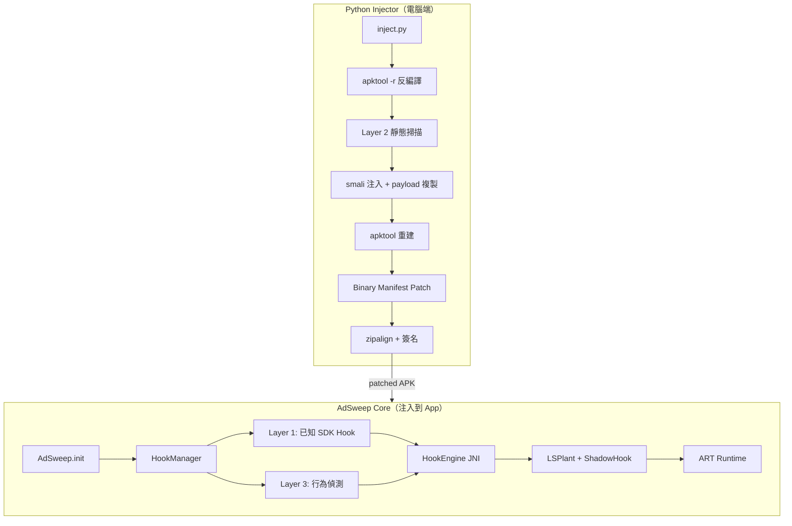
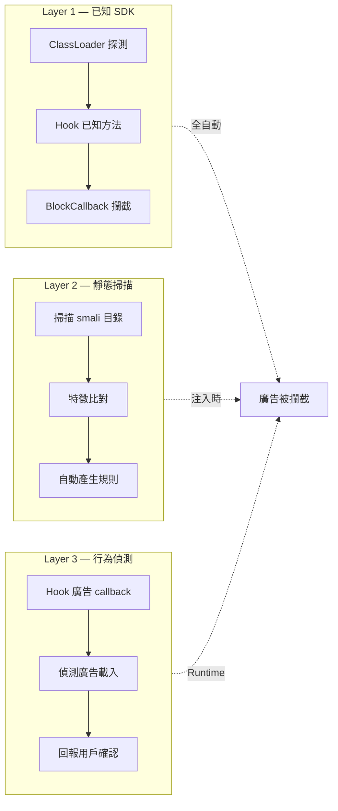

# AdSweep

通用 Android 廣告攔截模組。注入任意 APK，自動偵測並攔截已知廣告 SDK，支援 App 專屬規則。

## 特點

- **一條指令注入** — `python inject.py --apk target.apk`
- **不碰資源檔** — 使用 `-r` 模式反編譯，只改 smali，資源完整保留
- **自動偵測** — 掃描 APK 裡的廣告 SDK（14 種 + Google UMP）
- **自動產生建議規則** — 掃描結果自動轉成可用的 Hook 規則
- **規則驅動** — JSON 設定檔，通用規則 + App 專屬規則
- **多種攔截方式** — 回傳 void/null/true/false/0/空字串
- **Runtime Hook** — 不修改 App 原始 smali 字節碼
- **免 root** — 注入後的 APK 在任何設備上都能運作
- **Graceful Degradation** — AdSweep 任何錯誤都不會導致 App crash

## 快速開始

```bash
cd injector

# 基本注入（只用通用規則）
python inject.py --apk target.apk

# 帶 App 專屬規則
python inject.py --apk target.apk --rules rules/money_manager.json

# 完整參數
python inject.py --apk target.apk \
  --output patched.apk \
  --rules rules/my_app.json \
  --keystore my.keystore \
  --ks-pass mypass
```

## 架構總覽



## 三層偵測架構



## 文件

| 文件 | 說明 |
|------|------|
| [doc/ARCHITECTURE.md](doc/ARCHITECTURE.md) | 技術架構詳解 |
| [doc/DESIGN.md](doc/DESIGN.md) | 設計決策與演進 |
| [doc/RULES.md](doc/RULES.md) | 規則系統說明與自訂規則教學 |
| [doc/BUILD.md](doc/BUILD.md) | 建置與開發指南 |
| [doc/RULE_ENGINE.md](doc/RULE_ENGINE.md) | 規則引擎設計（條件式攔截、域名清單整合） |
| [doc/RULE_REPOSITORY.md](doc/RULE_REPOSITORY.md) | 規則倉庫設計（社群分享、自動下載） |
| [doc/BUSINESS.md](doc/BUSINESS.md) | 商業分析（SWOT、競爭者、營收、法律、成長策略） |

## 支援的廣告 SDK（通用規則）

AdMob, AppLovin, Facebook Audience Network, IronSource, Unity Ads, Vungle, AdColony, InMobi, Chartboost, MoPub, Kakao AdFit, Coupang Ads, StartApp, Pangle (ByteDance), Google UMP

## 實測結果（Money Manager）

- 22 hooks 成功安裝（13 通用 + 9 App 專屬）
- 6 個 Layer 3 monitors 安裝（WebView + 5 個廣告 callback）
- 廣告攔截、簽名繞過、追蹤封堵、GDPR 跳過
- Android 14 (API 34) 模擬器驗證通過，零 crash

## 系統需求

- Python 3.8+
- Java 11+（baksmali 用）
- Android SDK build-tools 36.1.0（zipalign, apksigner, d8）
- apktool 3.0.1+
- androguard（`pip install androguard`，binary manifest 解析用）

## 授權

MIT License
