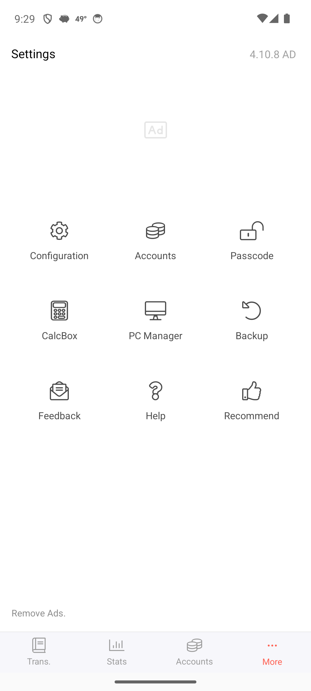
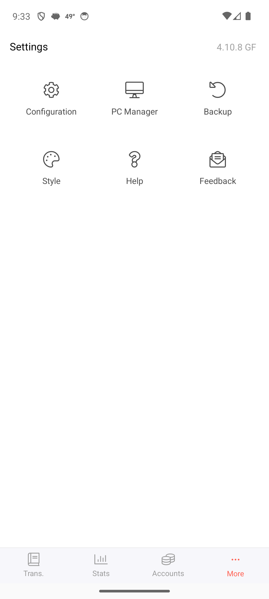
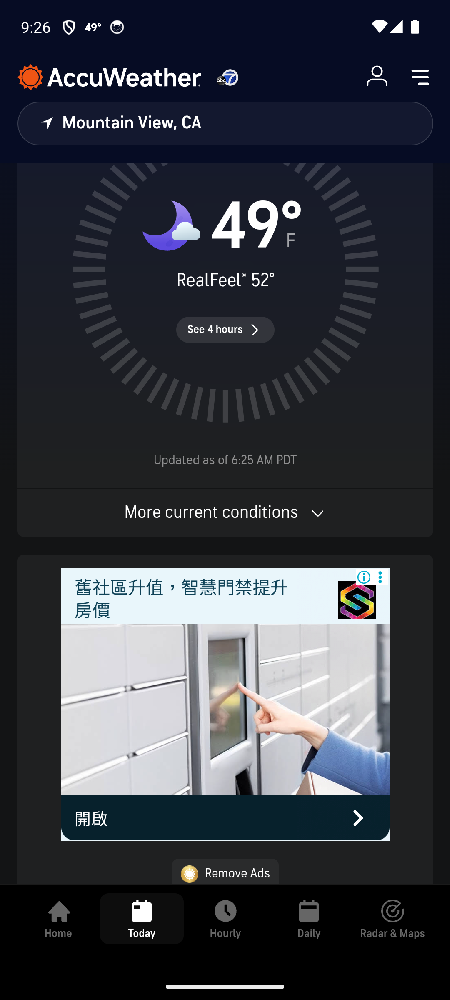
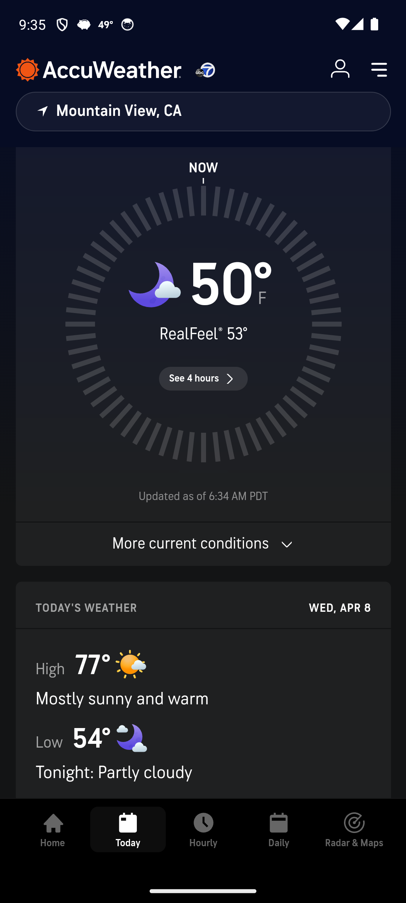
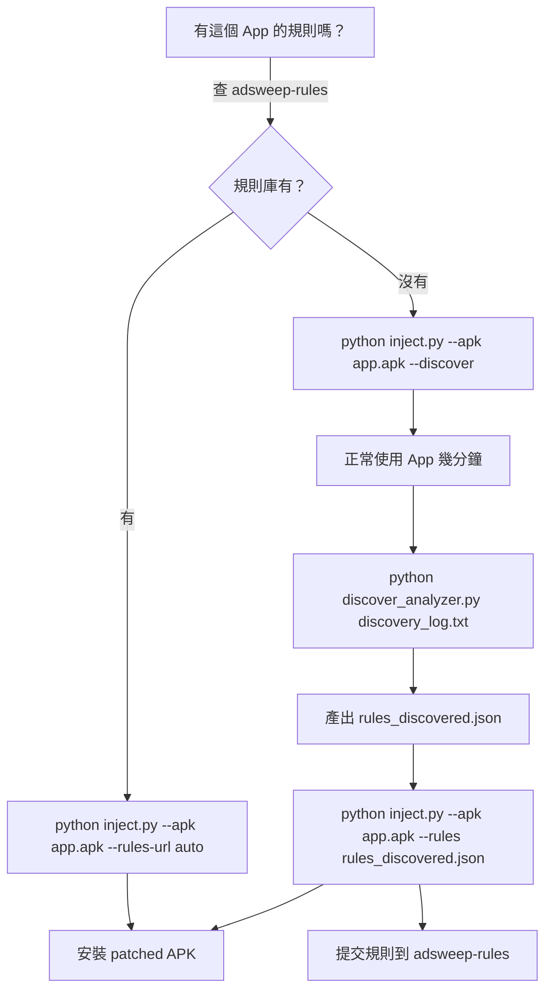
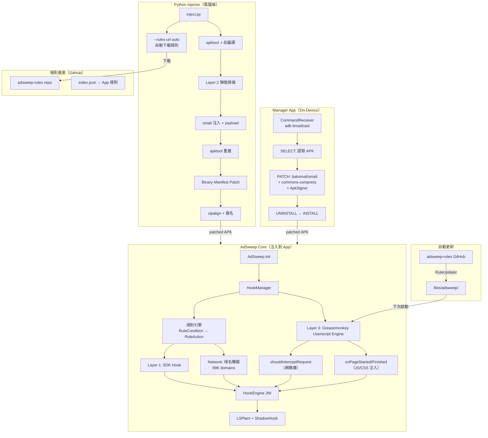
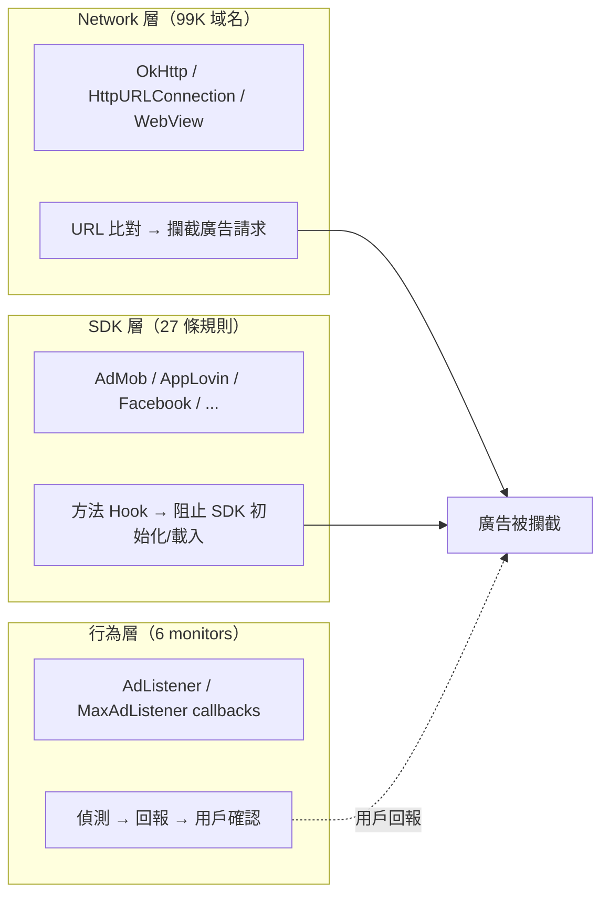

# AdSweep

通用 Android 廣告攔截模組。注入任意 APK，自動偵測並攔截已知廣告 SDK，支援社群規則倉庫自動下載。

## 特點

- **On-Device Patching** — Manager App 在手機上完成 SELECT → PATCH → INSTALL 全流程
- **一條指令注入** — `python inject.py --apk target.apk --rules-url auto`
- **自動下載規則** — 從社群規則倉庫自動匹配 App 專屬規則
- **99,000+ 域名攔截** — 整合 EasyList + EasyPrivacy + AdGuard 域名清單
- **條件式攔截** — 規則引擎支援域名比對、參數檢查、正則匹配
- **自動發現模式** — `--discover` 自動記錄廣告行為，產出可用規則
- **不碰資源檔** — 使用 `-r` 模式反編譯，資源完整保留
- **14+ 廣告 SDK** — 內建通用規則覆蓋主流廣告平台
- **Runtime Hook** — 不修改原始 smali，透過 LSPlant 動態攔截
- **免 root** — 注入後的 APK 在任何設備上都能運作
- **Graceful Degradation** — AdSweep 任何錯誤都不會導致 App crash

## 實際效果

### Money Manager（記帳 App）

| Before | After (AdSweep) |
|:------:|:---------------:|
|  |  |
| Ad 佔位框 · "4.10.8 **AD**" · "Remove Ads." | 無廣告 · "4.10.8 **GF**" · 乾淨介面 |

### AccuWeather（天氣 App — WebView 混合式）

| Before | After (AdSweep) |
|:------:|:---------------:|
|  |  |
| 底部廣告橫幅 · "Remove Ads" 按鈕 | 無廣告 · 直接顯示天氣資訊 |

> **攔截統計：** 23 hooks · 99,000+ 域名 · 2 userscripts · 零 crash

## 快速開始

### Manager App（On-Device，推薦）

```bash
# 建置並安裝 Manager
./gradlew :manager:assembleDebug
adb install -r manager/build/outputs/apk/debug/manager-debug.apk

# 啟動 Manager
adb shell am start -n com.adsweep.manager/.MainActivity

# 完整流程（N 是 component 參數，Android 14+ 必須）
N="-n com.adsweep.manager/.CommandReceiver"
adb shell am broadcast -a com.adsweep.manager.CMD_SELECT $N --es package com.example.app
adb shell am broadcast -a com.adsweep.manager.CMD_PATCH $N       # 自動下載 rules，約 50-90 秒
adb shell am broadcast -a com.adsweep.manager.CMD_UNINSTALL $N   # 確認解除安裝
adb shell am broadcast -a com.adsweep.manager.CMD_INSTALL $N     # 自動重簽 splits，確認安裝
```

**自動化功能：**
- **Rules 自動下載** — PATCH 時從 [adsweep-rules](https://github.com/tzyyung/adsweep-rules) 自動取得 app-specific 規則（簽名繞過、廣告封鎖等）
- **Split APK 支援** — INSTALL 時自動重簽名 split APKs 並一起安裝，資源不遺失

### Python Injector（PC 端）

```bash
cd injector

# 最簡單：自動下載規則（從社群規則庫）
python inject.py --apk target.apk --rules-url auto

# 手動指定規則
python inject.py --apk target.apk --rules rules/money_manager.json

# 發現模式：自動分析 App 的廣告行為
python inject.py --apk target.apk --discover
```

## 使用流程



## 架構總覽



## 攔截層級



## 文件

| 文件 | 說明 |
|------|------|
| [doc/ARCHITECTURE.md](doc/ARCHITECTURE.md) | 技術架構詳解 |
| [doc/DESIGN.md](doc/DESIGN.md) | 設計決策與演進 |
| [doc/RULES.md](doc/RULES.md) | 規則系統說明與自訂規則教學 |
| [doc/BUILD.md](doc/BUILD.md) | 建置與開發指南 |
| [doc/RULE_ENGINE.md](doc/RULE_ENGINE.md) | 規則引擎架構（條件式攔截、Easy Rules 模式） |
| [doc/RULE_REPOSITORY.md](doc/RULE_REPOSITORY.md) | 規則倉庫設計（社群分享、自動下載） |
| [doc/BUSINESS.md](doc/BUSINESS.md) | 商業分析（SWOT、競爭者、營收、法律） |
| [doc/GAPS.md](doc/GAPS.md) | 待考慮事項（21 項 + 建議） |

## 社群規則倉庫

規則由社群維護，存放在 [tzyyung/adsweep-rules](https://github.com/tzyyung/adsweep-rules)。

```bash
# 一般用戶：自動下載
python inject.py --apk app.apk --rules-url auto

# 貢獻者：分析 App → 提交規則
python inject.py --apk app.apk --discover
# ...使用 App...
python discover_analyzer.py discovery_log.txt
# 提交 PR 到 adsweep-rules
```

## 支援的廣告 SDK（內建通用規則）

AdMob, AppLovin, Facebook Audience Network, IronSource, Unity Ads, Vungle, AdColony, InMobi, Chartboost, MoPub, Kakao AdFit, Coupang Ads, StartApp, Pangle (ByteDance), Google UMP

## 實測結果（Money Manager）

- 23 hooks 成功安裝（SDK 規則 + 域名攔截 + App 專屬）
- 99,449 個廣告域名載入
- 6 個 Layer 3 monitors
- 廣告攔截、簽名繞過、追蹤封堵、GDPR 跳過
- `--rules-url auto` 自動下載規則驗證通過
- `--discover` 模式自動發現 2 個廣告方法
- Android 14 (API 34) 模擬器驗證，零 crash
- **Manager App on-device patch**: SELECT → PATCH → UNINSTALL → INSTALL 全流程驗證通過
- LSPlant hook 引擎在 patched APK 中成功初始化

## 系統需求

- Python 3.8+
- Java 11+（baksmali 用）
- Android SDK build-tools 36.1.0（zipalign, apksigner, d8）
- apktool 3.0.1+
- androguard（`pip install androguard`，binary manifest 解析用）

## 授權

MIT License
