# AdSweep 技術架構

## 概覽

AdSweep 由三部分組成：

1. **Python Injector** — 在電腦上執行，將 Hook 模組注入到目標 APK
2. **Android Core** — 被注入的模組，在 App 啟動時自動攔截廣告
3. **Manager App** — Android 上的管理工具，可在手機上完成 SELECT → PATCH → UNINSTALL → INSTALL 全流程

## PC 端注入流程

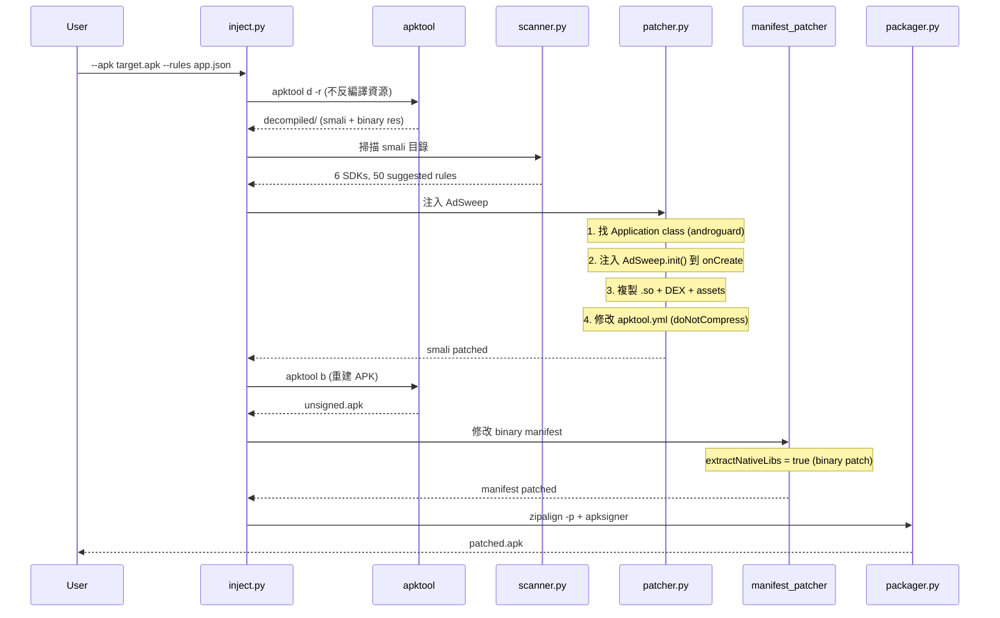

## Manager App On-Device 流程

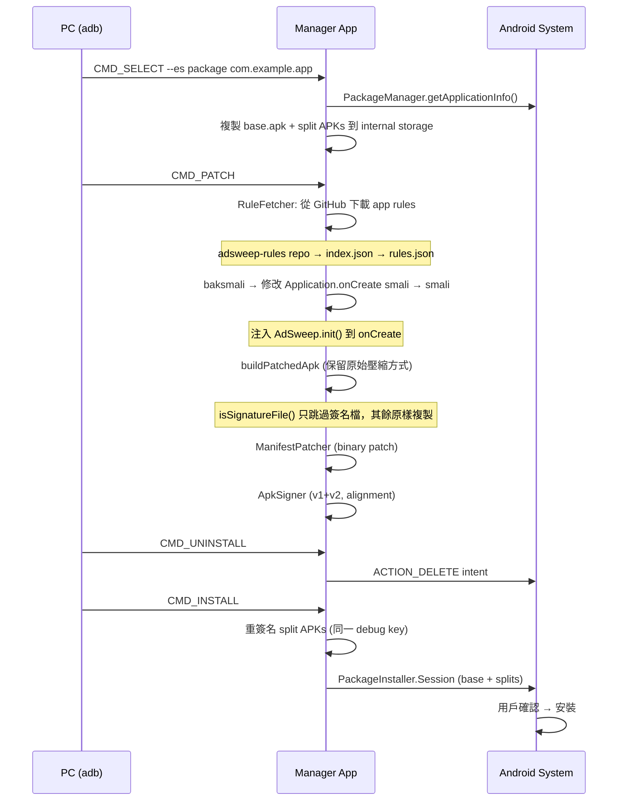

### CommandReceiver Broadcast 指令

所有指令需加 `-n com.adsweep.manager/.CommandReceiver`（Android 14+ 隱式 broadcast 限制）：

```bash
# 選取目標 App（複製 APK + splits 到 internal storage）
adb shell am broadcast -a com.adsweep.manager.CMD_SELECT \
  -n com.adsweep.manager/.CommandReceiver --es package com.example.app

# Patch（baksmali/smali + 打包 + 簽名，約 50-90 秒）
adb shell am broadcast -a com.adsweep.manager.CMD_PATCH \
  -n com.adsweep.manager/.CommandReceiver

# 解除安裝原版（彈出確認對話框）
adb shell am broadcast -a com.adsweep.manager.CMD_UNINSTALL \
  -n com.adsweep.manager/.CommandReceiver

# 安裝 patched APK（彈出安裝確認）
adb shell am broadcast -a com.adsweep.manager.CMD_INSTALL \
  -n com.adsweep.manager/.CommandReceiver

# 查看狀態
adb shell am broadcast -a com.adsweep.manager.CMD_STATUS \
  -n com.adsweep.manager/.CommandReceiver
```

### On-Device Patching 技術要點

| 元件 | 技術 | 說明 |
|------|------|------|
| DEX Patching | baksmali/smali | 避免 dexlib2 DexPool OOM 和 debug info 損壞 |
| APK 打包 | Apache Commons Compress | 保留原始壓縮方式（STORED/DEFLATED），只跳過簽名檔 |
| resources.arsc | 原樣複製（STORED） | 不修改資源表，保證資源引用完整 |
| Manifest | Binary patch (commons-compress) | extractNativeLibs=true, isSplitRequired=false |
| 簽名 | ApkSigner (setAlignmentPreserved=false) | 讓 ApkSigner 主動做 alignment |
| Split APK | Multi-APK install | 不合併 splits，重簽名後一起安裝（PackageInstaller.Session） |
| 記憶體 | File-based streaming | 避免同時載入所有 DEX 到記憶體 |
| App Rules | RuleFetcher | 自動從 adsweep-rules GitHub repo 下載 app-specific 規則 |

## 為什麼用 -r 模式

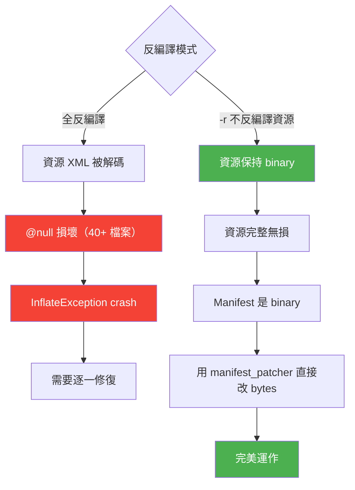

## Hook 引擎架構

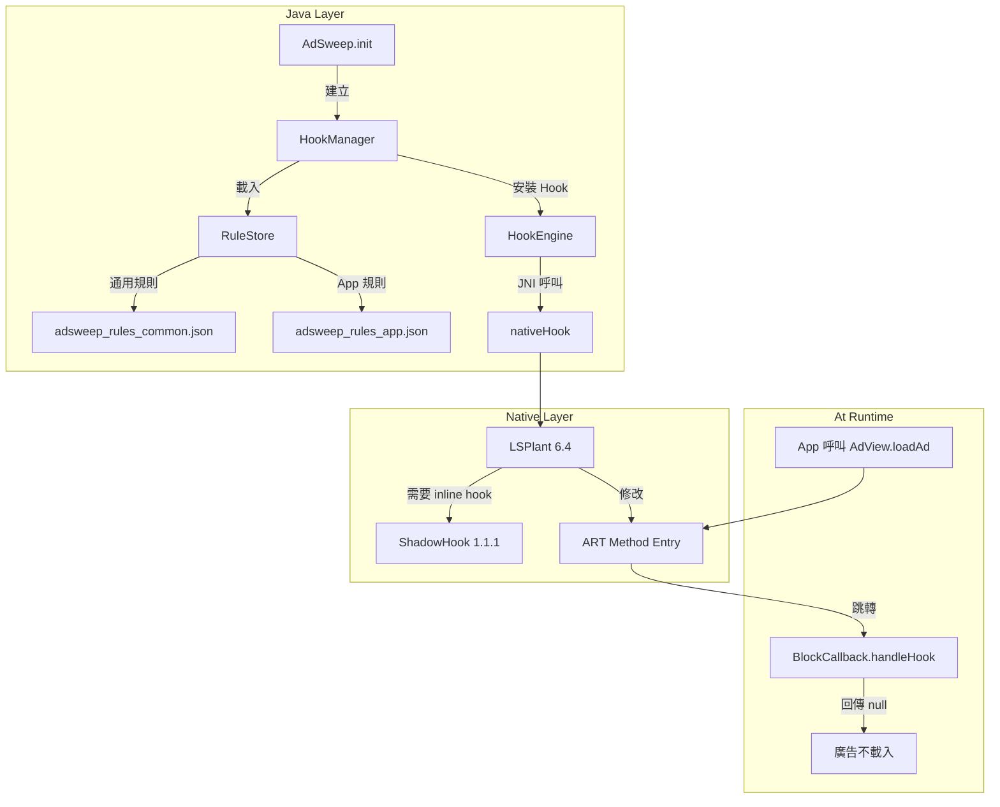

### LSPlant

[LSPlant](https://github.com/LSPosed/LSPlant) 是 LSPosed 團隊的 ART Hook 庫：
- 支援 Android 5.0 ~ 15（API 21-35）
- 透過修改 ART 方法入口指標實現 Java 方法 Hook
- 每個 App 進程獨立運作，不影響系統或其他 App
- 使用 `lsplant-standalone:6.4`

### ShadowHook

[ShadowHook](https://github.com/bytedance/android-inline-hook) 是 ByteDance 的 inline hook 庫：
- LSPlant 內部需要它來修改 ART 的 native 函數
- 提供 `shadowhook_hook_func_addr()` 做 native inline hook
- 提供 `shadowhook_dlsym()` 做符號解析

## 三層偵測架構

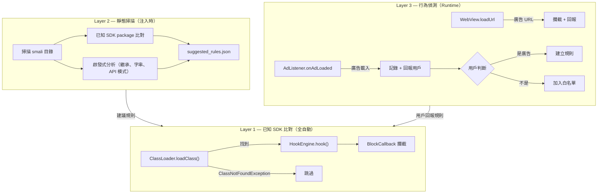

## 規則系統

詳見 [RULES.md](RULES.md)

## Binary Manifest Patching

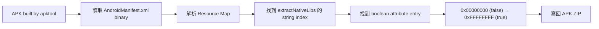

## 專案結構

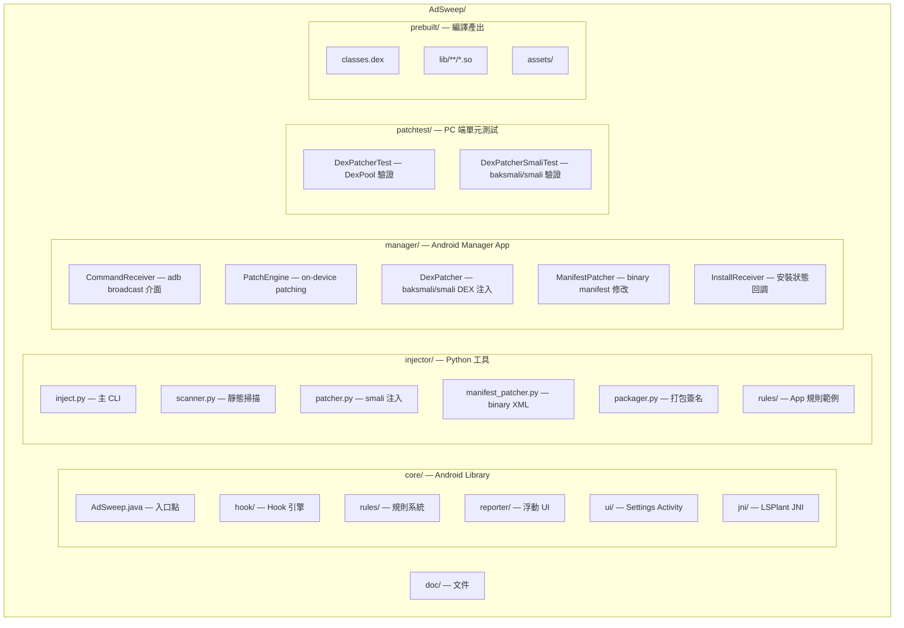

## 錯誤處理策略

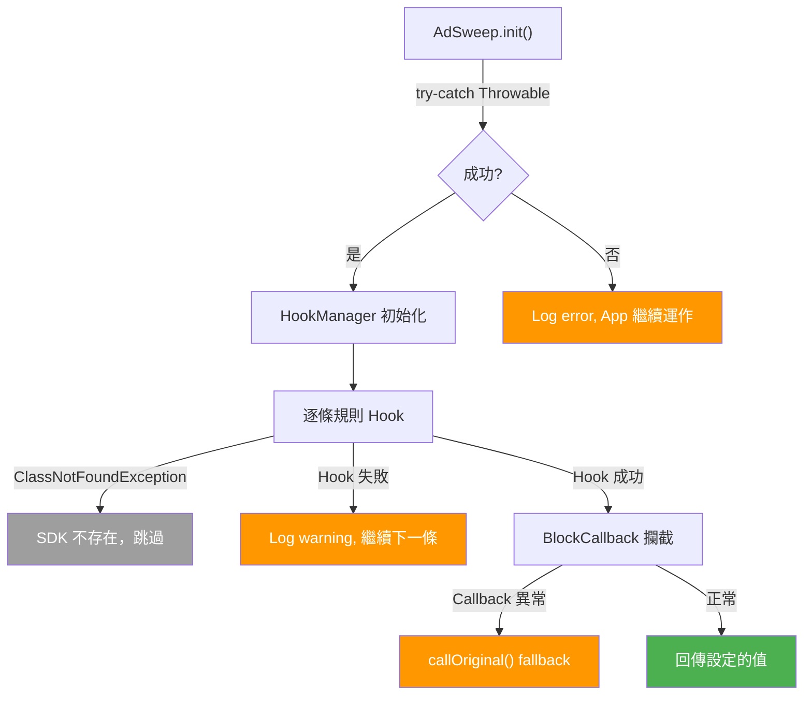

## 規則引擎

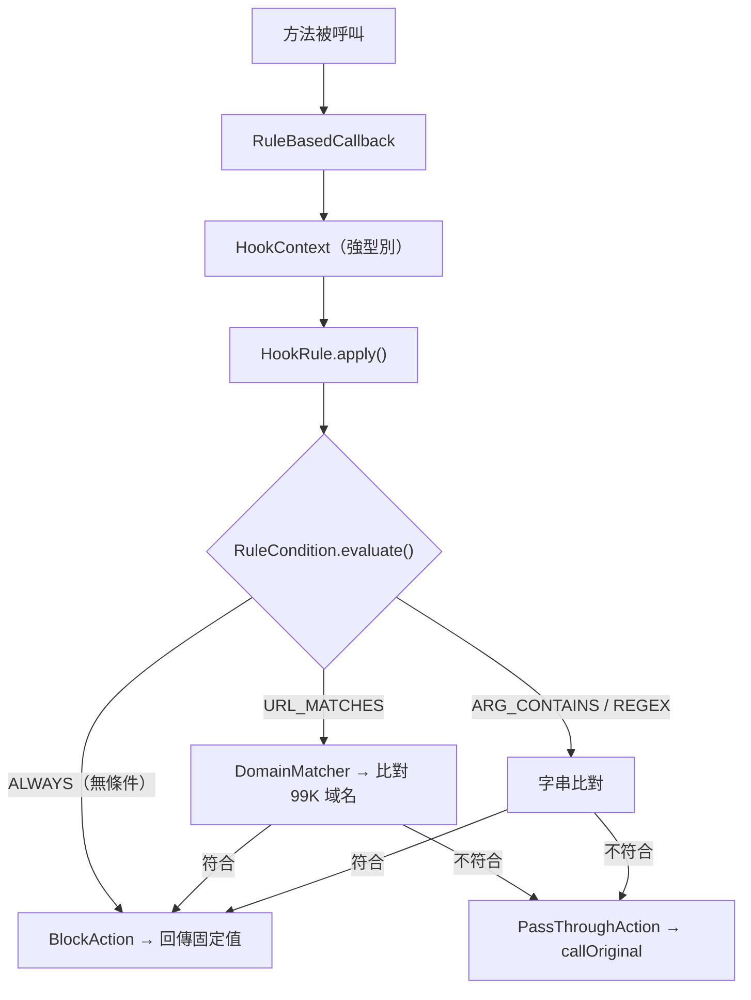

借鑑 Easy Rules 的設計模式（RuleCondition / RuleAction / HookRule），但簡化為 AdSweep 的 1-to-1 Hook 模型。

詳見 [RULE_ENGINE.md](RULE_ENGINE.md)

## Discover 模式

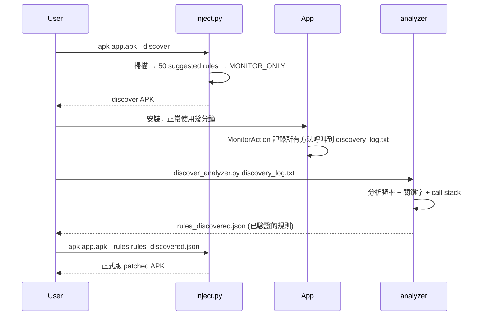

## 規則倉庫

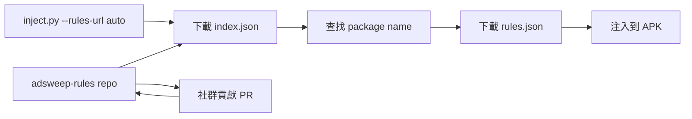

倉庫：[tzyyung/adsweep-rules](https://github.com/tzyyung/adsweep-rules)

## 已知限制

| 限制 | 說明 | 解決方向 |
|------|------|---------|
| Android API 36+ | ShadowHook linker error 12 | LSPlant fallback 仍可運作 |
| x86/x86_64 | ShadowHook 不支援 | 使用 ARM64 模擬器測試 |
| Binary Manifest | 目前只能改 boolean 屬性 | 未來擴充新增 permission/activity |
| Layer 3 UI | 需要 SYSTEM_ALERT_WINDOW | 未註冊到 manifest，降級為通知 |
| Split APK | 需同一把 keystore 簽名 | 手動重簽 split APK |
| On-device OOM | 大 APK (>50MB) 需 largeHeap | Manager 已設定 largeHeap=true |
| Android 14+ Broadcast | 隱式 broadcast 受限 | 需加 -n 指定 component |
