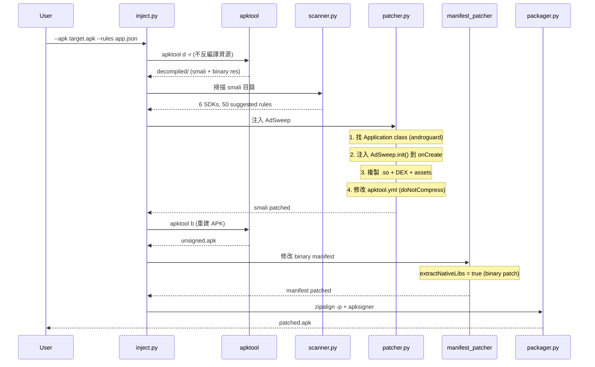
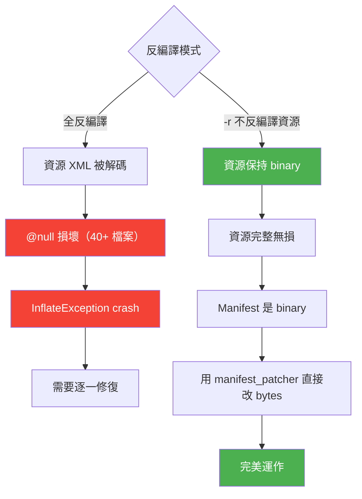
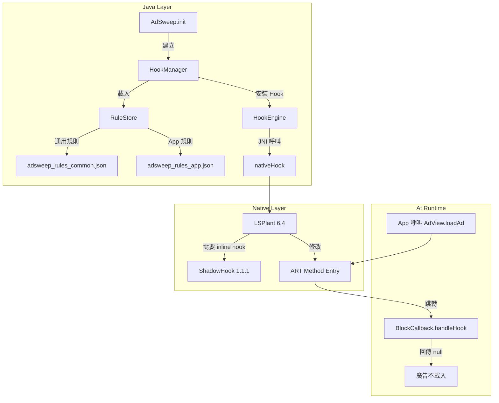
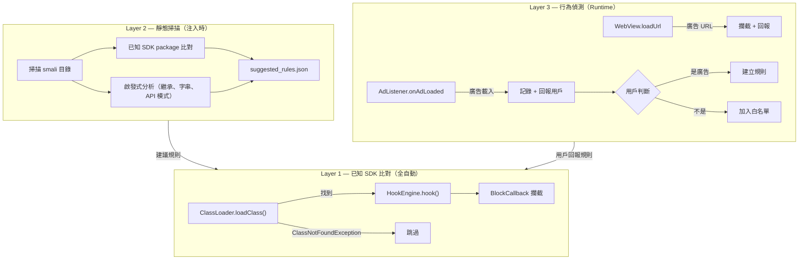
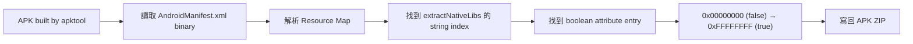
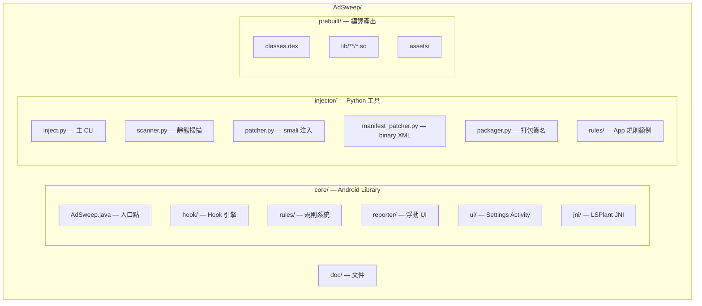
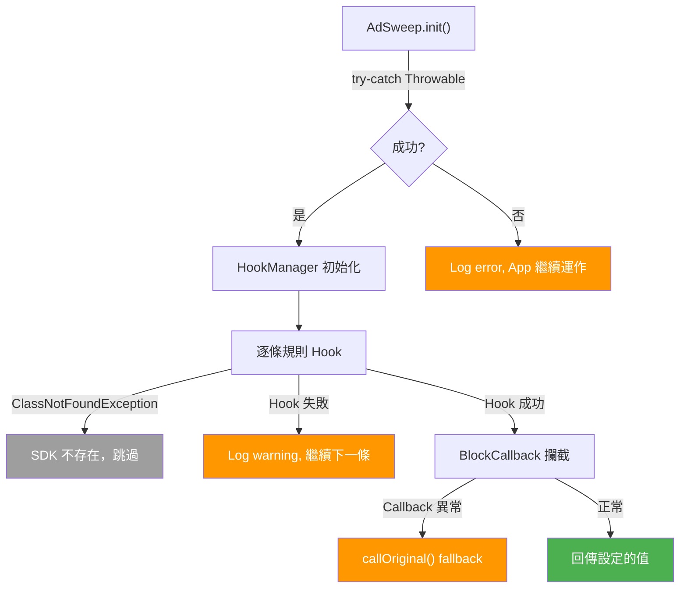

# AdSweep 技術架構

## 概覽

AdSweep 由兩部分組成：

1. **Python Injector** — 在電腦上執行，將 Hook 模組注入到目標 APK
2. **Android Core** — 被注入的模組，在 App 啟動時自動攔截廣告

## 注入流程

## 為什麼用 -r 模式

## Hook 引擎架構

### LSPlant

[LSPlant](https://github.com/LSPosed/LSPlant) 是 LSPosed 團隊的 ART Hook 庫：
- 支援 Android 5.0 ~ 15（API 21-35）
- 透過修改 ART 方法入口指標實現 Java 方法 Hook
- 每個 App 進程獨立運作，不影響系統或其他 App
- 使用 `lsplant-standalone:6.4`

### ShadowHook

[ShadowHook](https://github.com/bytedance/android-inline-hook) 是 ByteDance 的 inline hook 庫：
- LSPlant 內部需要它來修改 ART 的 native 函數
- 提供 `shadowhook_hook_func_addr()` 做 native inline hook
- 提供 `shadowhook_dlsym()` 做符號解析

## 三層偵測架構

## 規則系統

詳見 [RULES.md](RULES.md)

## Binary Manifest Patching

## 專案結構

## 錯誤處理策略

## 已知限制

| 限制 | 說明 | 解決方向 |
|------|------|---------|
| Android API 36+ | ShadowHook linker error 12 | LSPlant fallback 仍可運作 |
| x86/x86_64 | ShadowHook 不支援 | 使用 ARM64 模擬器測試 |
| Binary Manifest | 目前只能改 boolean 屬性 | 未來擴充新增 permission/activity |
| Layer 3 UI | 需要 SYSTEM_ALERT_WINDOW | 未註冊到 manifest，降級為通知 |
| Split APK | 需同一把 keystore 簽名 | 手動重簽 split APK |
