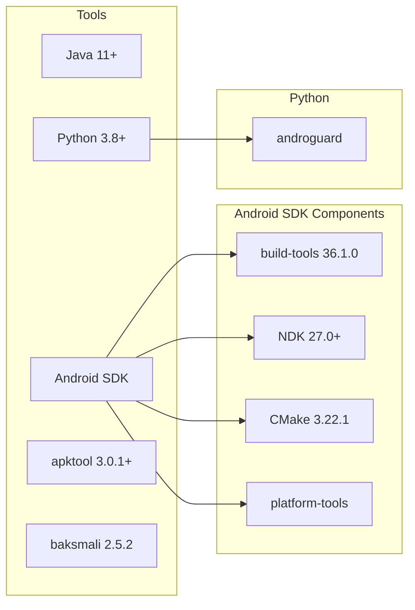
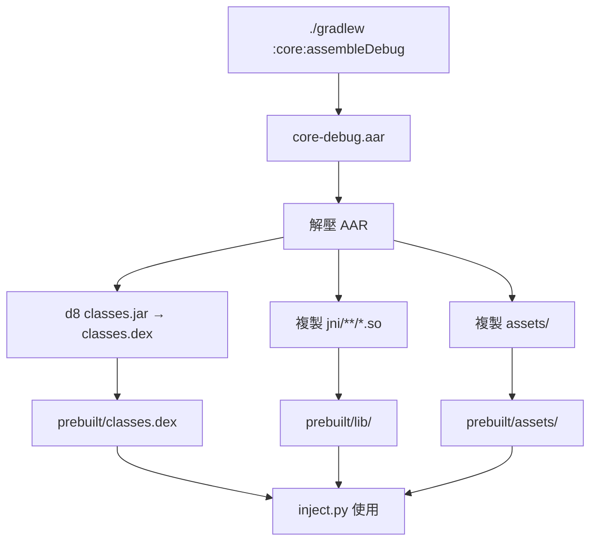
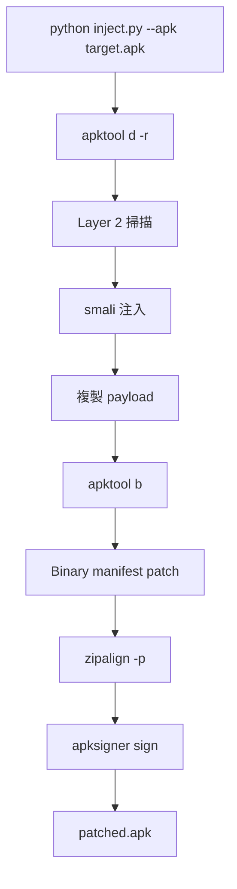

# AdSweep 建置與開發指南

## 開發環境



## 工具路徑

`injector/config.py`：

```python
ANDROID_HOME = "~/Library/Android/sdk"
BUILD_TOOLS_VERSION = "36.1.0"
APKTOOL = "/opt/homebrew/bin/apktool"
```

## 建置流程



### 步驟

```bash
# 1. 建立 local.properties
echo "sdk.dir=$HOME/Library/Android/sdk" > local.properties

# 2. 編譯
./gradlew :core:assembleDebug

# 3. 更新 prebuilt
cd /tmp && mkdir aar && cd aar
unzip -q path/to/core-debug.aar

mkdir dex
~/Library/Android/sdk/build-tools/36.1.0/d8 --output dex classes.jar

PREBUILT=path/to/AdSweep/prebuilt
cp dex/classes.dex $PREBUILT/
for abi in arm64-v8a armeabi-v7a; do
  mkdir -p $PREBUILT/lib/$abi
  cp jni/$abi/*.so $PREBUILT/lib/$abi/
done
cp assets/* $PREBUILT/assets/
```

## 注入流程



### 指令

```bash
cd injector

# 基本
python inject.py --apk target.apk

# 帶 App 規則
python inject.py --apk target.apk \
  --rules rules/money_manager.json \
  --keystore path/to/debug.keystore

# 保留工作目錄（除錯用）
python inject.py --apk target.apk --keep-work --work-dir ./work
```

### 自動下載規則

```bash
# 從社群規則庫自動下載（最推薦）
python inject.py --apk target.apk --rules-url auto

# 使用自訂規則庫
python inject.py --apk target.apk \
  --rules-url https://raw.githubusercontent.com/someone/adsweep-rules/main
```

### Discover 模式

```bash
# 1. 注入 discover 版本（只觀察不攔截）
python inject.py --apk target.apk --discover

# 2. 安裝，正常使用 App 幾分鐘

# 3. 拉 log（需 root 或 debug build）
adb shell cat /data/data/<package>/files/adsweep/discovery_log.txt > log.txt

# 4. 分析產出規則
python discover_analyzer.py log.txt -o rules.json

# 5. 用發現的規則注入正式版
python inject.py --apk target.apk --rules rules.json
```

### 更新域名清單

```bash
python domain_converter.py ../core/src/main/assets/adsweep_domains.txt
# 下載 EasyList + EasyPrivacy + AdGuard → 合併去重 → ~99K 域名
```

### 安裝

```bash
ADB=~/Library/Android/sdk/platform-tools/adb

# 單一 APK
$ADB install patched.apk

# Split APK（需同一把 keystore 簽名）
$ADB uninstall com.example.app
$ADB install-multiple \
  patched.apk \
  split_config.arm64_v8a.apk \
  split_config.xxhdpi.apk
```

### 驗證

```bash
$ADB logcat -s "AdSweep" "AdSweep.HookManager" "AdSweep.Block" "AdSweep.L3"
```

預期輸出：

```
I AdSweep : === AdSweep Initializing ===
I AdSweep : LSPlant initialized successfully
I AdSweep : Hook engine ready
I AdSweep.HookManager: Loading 32 rules
I AdSweep.HookManager: Hooked: com.google.android.gms.ads.BaseAdView.loadAd [BLOCK_RETURN_VOID]
...
I AdSweep.HookManager: Initialization complete: 22/32 hooks installed
I AdSweep.L3: Installing Layer 3 monitors...
I AdSweep.L3: Hooked: WebView.loadUrl
I AdSweep.L3: Monitoring: com.google.android.gms.ads.AdListener.onAdLoaded
I AdSweep.L3: Layer 3: 6 monitors installed
I AdSweep : === AdSweep Ready: 22 hooks active ===
I AdSweep.Block: Blocked: com.applovin.sdk.AppLovinSdk.initialize
```

## 簽名金鑰

```bash
keytool -genkeypair -v \
  -keystore debug.keystore \
  -alias debugkey \
  -keyalg RSA -keysize 2048 \
  -validity 10000 \
  -storepass android \
  -keypass android \
  -dname "CN=Debug, OU=Debug, O=Debug, L=Debug, ST=Debug, C=US"
```

## 模擬器測試

ShadowHook 不支援 x86，需使用 ARM64 映像：

```bash
sdkmanager "system-images;android-34;google_apis;arm64-v8a"

avdmanager create avd -n AdSweep_Test \
  -k "system-images;android-34;google_apis;arm64-v8a" -d "pixel_6"

emulator -avd AdSweep_Test
```

> API 36 的 ShadowHook 有 linker error 12，但 LSPlant 仍可運作。建議用 API 34。

## 目錄結構

```
AdSweep/
├── build.gradle.kts            # Root Gradle
├── settings.gradle.kts
├── local.properties            # SDK path
├── core/                       # Android Library
│   ├── build.gradle.kts        # NDK/CMake/LSPlant config
│   └── src/main/
│       ├── java/com/adsweep/   # Java sources
│       ├── jni/                # C++ (LSPlant JNI)
│       └── assets/             # Built-in rules JSON
├── injector/                   # Python toolchain
│   ├── inject.py               # Main CLI
│   ├── decompiler.py           # apktool -r wrapper
│   ├── scanner.py              # Layer 2 + auto rules
│   ├── patcher.py              # smali injection
│   ├── manifest_patcher.py     # Binary AXML patching
│   ├── packager.py             # zipalign + sign
│   ├── config.py               # Tool paths
│   ├── baksmali.jar            # DEX → smali
│   └── rules/                  # App rule examples
├── prebuilt/                   # Build output for injector
│   ├── classes.dex
│   ├── lib/{arm64-v8a,armeabi-v7a}/*.so
│   └── assets/
└── doc/                        # Documentation
```
