# AdSweep 商業分析與策略

## SWOT 分析

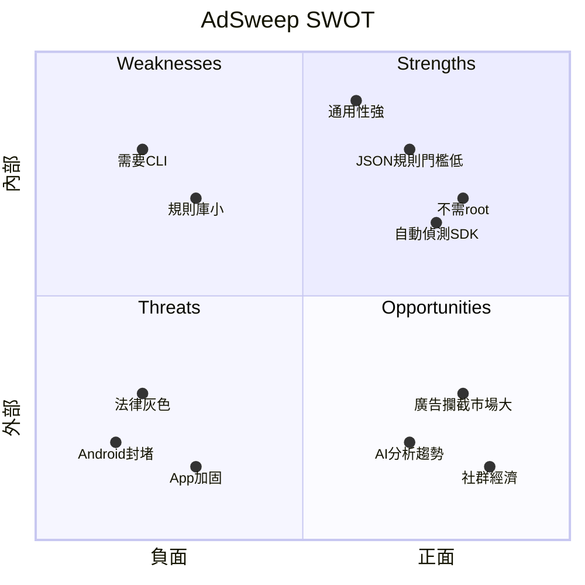

### Strengths（優勢）

| 優勢 | 說明 |
|------|------|
| **JSON 規則門檻低** | 比 ReVanced（Kotlin）和 Xposed（Java module）簡單很多，社群貢獻門檻最低 |
| **免 root** | 比 LSPosed/Magisk 的門檻低，覆蓋更多設備 |
| **通用性** | 不限特定 App（ReVanced 只做 YouTube 等少數 App） |
| **自動偵測** | Layer 2 掃描 + 建議規則，半自動化 |
| **規則與工具分離** | 規則是資料（JSON），不是程式碼，容易維護和分享 |
| **多層防禦** | SDK Hook + URL 攔截 + 行為偵測，比單一方案更全面 |

### Weaknesses（劣勢）

| 劣勢 | 說明 | 建議 |
|------|------|------|
| **SDK 規則庫小** | 目前只有 Money Manager 一個 App 的完整 SDK 規則 | 1. 整合現有域名清單（5 萬+ 域名，立即可用） 2. 逐步建立 Top 50 App 的 SDK 規則 |
| **需要 CLI** | 一般人不會用命令列 | 做 Web 平台或 Android Manager App |
| **每次 App 更新要重新注入** | 不像 DNS 方案一次設定永久生效 | 未來做自動化更新檢測 |
| **規則產出依賴逆向分析** | 即使有建議規則，App 專屬規則仍需人工 | AI 分析引擎（Phase 7） |
| **Layer 3 尚未穩定** | 行為偵測重設計後覆蓋面有限 | 逐步增加偵測點 |

### Opportunities（機會）

| 機會 | 說明 | 建議 |
|------|------|------|
| **廣告攔截市場持續成長** | 全球行動廣告攔截用戶超過 6 億 | 切入免 root 市場 |
| **AI 分析 smali** | LLM 能力持續提升，自動逆向分析可行 | 建立 AI → 規則的 pipeline |
| **AdGuard 域名清單整合** | 幾十萬條現成規則 | 實作規則引擎後直接用 |
| **ReVanced 社群模式驗證可行** | fork + 社群維護 patch 的模式已成功 | 複製其社群運營模式 |
| **企業隱私需求** | 公司可能需要去除 App 追蹤 | 企業版定位 |
| **新興市場** | 東南亞/印度用戶對廣告容忍度低，付費意願對工具型產品有 | 針對高廣告密度市場推廣 |

### Threats（威脅）

| 威脅 | 嚴重性 | 說明 | 對策 |
|------|--------|------|------|
| **法律風險** | 高 | 修改 APK 可能違反 DMCA/著作權 | 定位為「隱私工具」而非「破解工具」；伺服器放在法律友善的國家 |
| **Android 封堵 Hook** | 中 | Google 可能在新版 Android 限制 ART Hook | LSPlant 團隊持續跟進；最壞情況回退到 smali patch |
| **App 加固** | 中 | 360 加固、騰訊樂固等殼保護 | 先做未加固 App，加固 App 需要額外脫殼步驟 |
| **Google Play Protect** | 中 | 可能標記修改版 APK | 用戶需手動允許；文件中說明 |
| **競爭者跟進** | 低 | Lucky Patcher 等可能模仿 JSON 規則模式 | 靠規則庫和 AI 分析的先發優勢 |
| **App 開發者對抗** | 低 | 增加混淆強度、server-side ad rendering | 大部分 App 不會為了對抗而改架構 |

## 競爭者分析

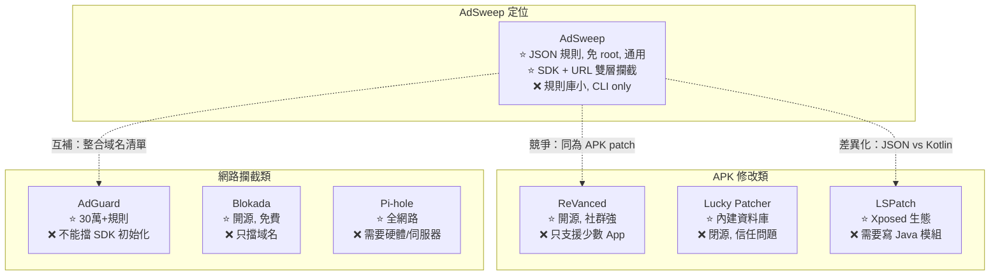

### 詳細對比

| 維度 | AdSweep | ReVanced | Lucky Patcher | AdGuard | LSPatch |
|------|---------|----------|---------------|---------|---------|
| **需要 root** | 否 | 否 | 否 | 否 | 否 |
| **修改 APK** | 是 | 是 | 是 | 否 | 是 |
| **規則格式** | JSON | Kotlin | 二進位 | 文字 | Java module |
| **貢獻門檻** | 低 | 中 | 高 | 最低 | 中 |
| **通用性** | 任何 App | 特定 App | 任何 App | 任何 App | 任何 App |
| **攔截層級** | SDK + URL | SDK | 各種 | URL only | SDK |
| **開源** | 是 | 是 | 否 | 部分 | 是 |
| **社群規模** | 無 | 大 | 中 | 大 | 中 |
| **商業模式** | 待定 | 捐款 | 免費+內購 | App 付費 | 無 |

### 競爭定位

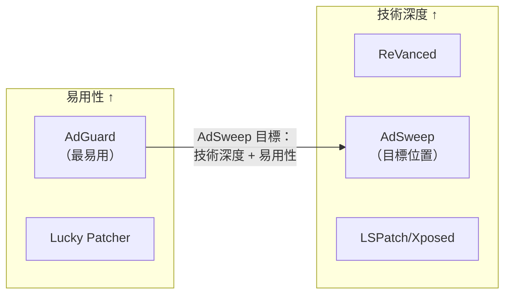

AdSweep 的差異化：
1. **比 AdGuard 深** — 能攔截 SDK 初始化，不只是 URL
2. **比 ReVanced 廣** — 不限特定 App
3. **比 LSPatch 簡單** — JSON 規則，不用寫 Java
4. **比 Lucky Patcher 透明** — 開源，可審計

## 產品形態建議

### 推薦：開源核心 + SaaS 平台

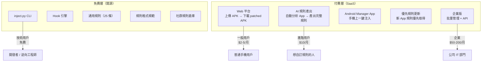

### 定價策略

| Tier | 價格 | 包含 |
|------|------|------|
| **Free** | $0 | CLI 工具 + 通用規則 + 社群規則 |
| **Basic** | $3/月 | Web 平台注入 + 所有 App 規則 |
| **Pro** | $10/月 | AI 分析 + 自訂規則產出 + 優先支援 |
| **Enterprise** | $50-200/月 | 批量管理 + API + 私有規則庫 |

### 為什麼這樣定價

- **Free 要夠用** — 技術用戶用免費版就能完成所有事，他們是社群的核心
- **Basic 賣便利性** — 一般人願意為「不用裝 Python」付費
- **Pro 賣 AI** — 自動分析 smali 產出規則，這是真正的技術護城河
- **Enterprise 賣合規** — 公司需要去除 App 追蹤，願意付高價

## 營收預估

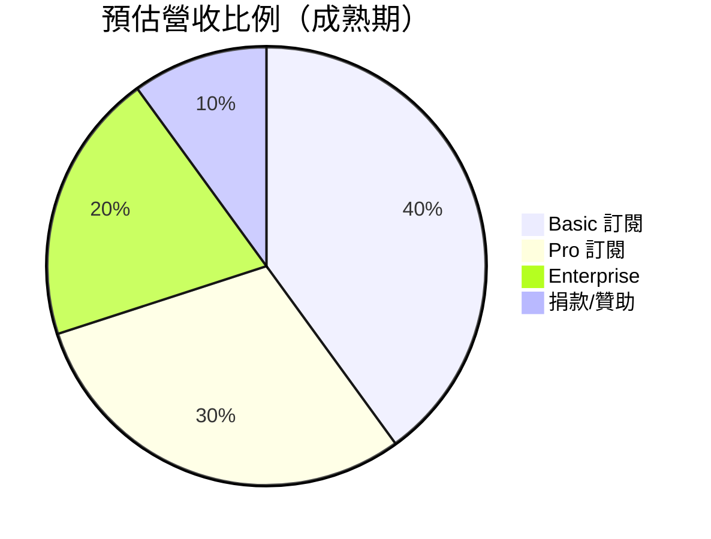

## 法律風險分析

### 各法域對比

| 法域 | 逆向工程 | APK 修改 | 風險等級 | 備註 |
|------|---------|---------|---------|------|
| **美國** | DMCA 1201 例外：安全研究 | 灰色地帶 | 中 | 需包裝為「隱私/安全工具」 |
| **歐盟** | 軟體指令允許互通性逆向 | 相對寬鬆 | 低 | GDPR 支持隱私工具 |
| **台灣** | 著作權法第59條：合理使用 | 灰色地帶 | 中 | 「個人使用」可辯護 |
| **中國** | 反不正當競爭法 | 風險較高 | 高 | 商業行為可能觸法 |
| **日本** | 不正競爭防止法 | 灰色地帶 | 中 | 技術中立原則 |

### 風險緩解

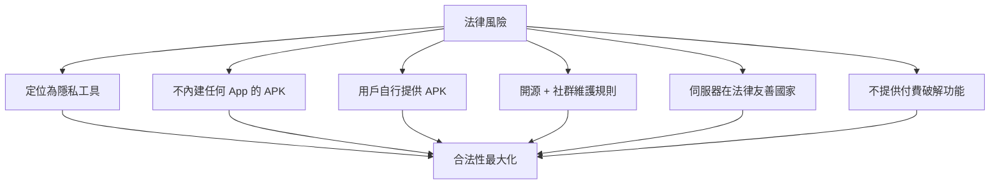

**關鍵原則：**
1. **AdSweep 本身不分發任何 APK** — 只提供工具和規則
2. **定位為隱私保護** — 去除追蹤、封堵資料收集，不是「破解」
3. **規則由社群維護** — 平台不為規則內容負責（類似 GitHub 託管程式碼）
4. **不做付費功能的破解** — 只做廣告移除和隱私保護

## 成長策略

### Phase 1：冷啟動（0-1000 用戶）

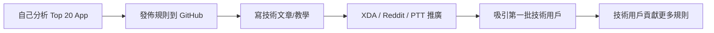

- 自己分析 Top 20 常見有廣告的 App（新聞、工具、遊戲）
- 在 XDA Developers、Reddit r/Android、PTT 等社群發佈
- 寫詳細的教學文章，降低使用門檻

### Phase 2：社群成長（1000-10000 用戶）

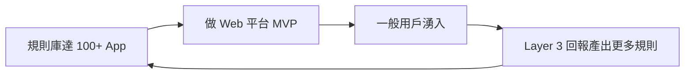

- 規則庫覆蓋 100+ 常見 App
- Web 平台上線（Basic tier）
- Layer 3 用戶回報機制驅動規則增長

### Phase 3：商業化（10000+ 用戶）

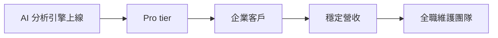

- AI 分析引擎上線
- 企業版推出
- 組建全職團隊

## 規則貢獻者激勵

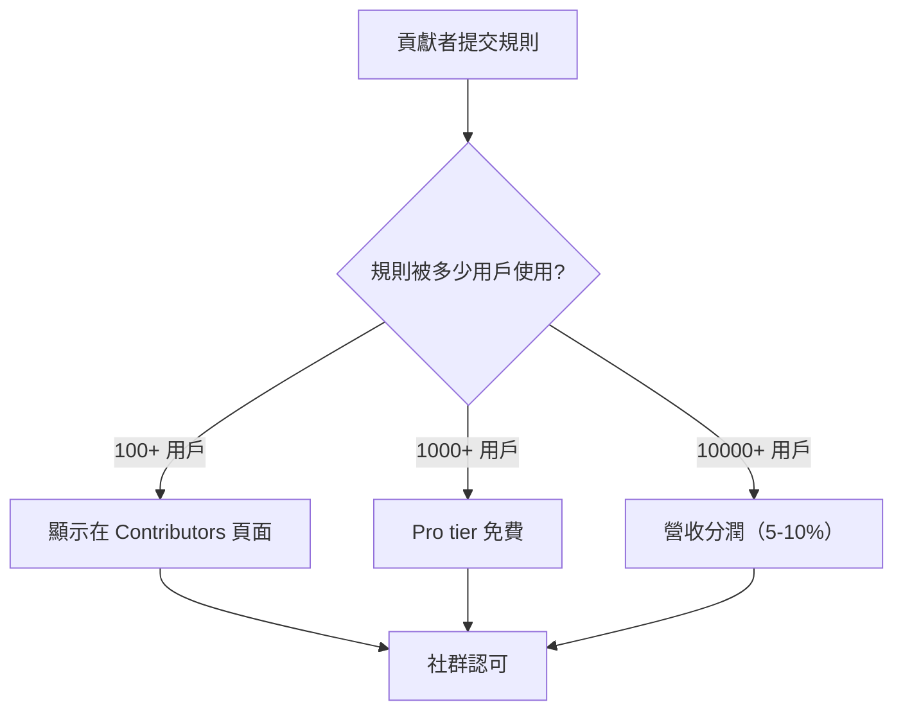

## 規則整合策略 — 借力現有生態

AdSweep 不需要從零建立規則庫。大量現有規則可以直接或轉譯後使用。

### 規則來源地圖

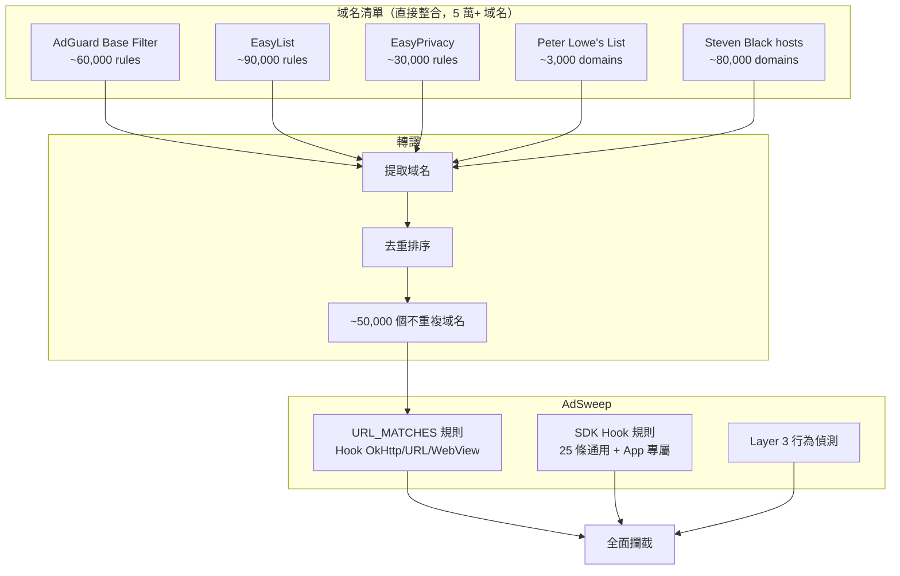

### 整合對照表

| 來源 | 規則數量 | 轉譯方式 | 難度 | 前提 |
|------|---------|---------|------|------|
| AdGuard Base Filter | ~60,000 | 提取域名 → URL_MATCHES | 低 | 規則引擎 |
| EasyList | ~90,000 | 提取域名 → URL_MATCHES | 低 | 規則引擎 |
| EasyPrivacy | ~30,000 | 提取域名 → URL_MATCHES | 低 | 規則引擎 |
| Peter Lowe's List | ~3,000 | 域名直接用 | 最低 | 規則引擎 |
| Steven Black hosts | ~80,000 | 域名直接用 | 最低 | 規則引擎 |
| ReVanced patches | ~200 | 分析 Kotlin → 翻譯 JSON | 高 | 人工分析 |
| Xposed 模組 | 數百個 | 分析 Java → 翻譯 JSON | 高 | 人工分析 |

### 整合後的規則覆蓋

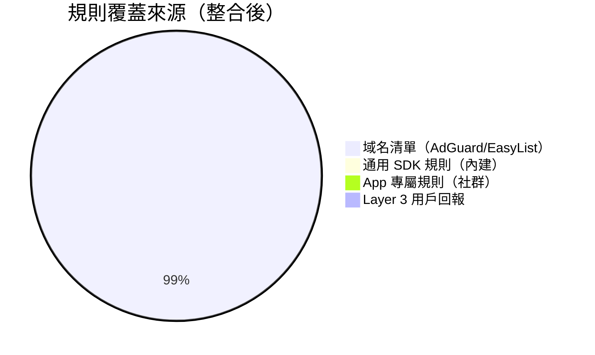

**關鍵洞察：規則引擎是槓桿。** 只要實作 `URL_MATCHES`，AdSweep 的規則量就從 25 條跳到 5 萬+ 條。這不是從零累積，而是站在 AdGuard/EasyList 十幾年的成果上。

### 兩層攔截的互補

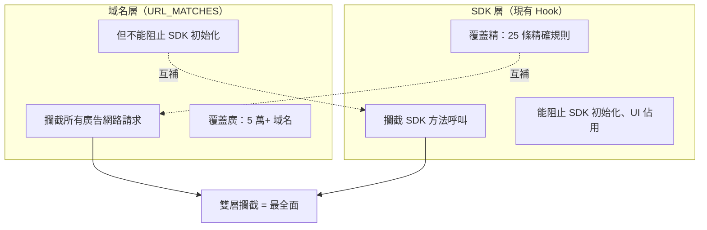

域名層擋住**網路請求**（廣告素材載入），SDK 層擋住**本地行為**（SDK 初始化、UI 佔用、追蹤）。兩層加起來比任何單一方案都全面。

## 技術護城河

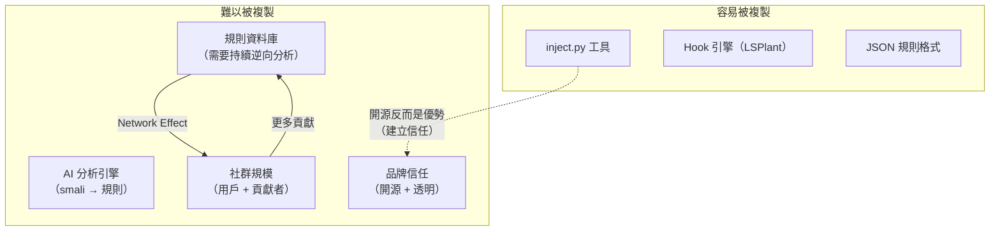

**核心護城河不是程式碼，是規則庫 + AI + 社群。**

## 平台擴展可能性

| 方向 | 可行性 | 優先順序 | 說明 |
|------|--------|---------|------|
| **Android Manager App** | 高 | P1 | 類似 ReVanced Manager，手機上操作 |
| **Web 平台** | 高 | P1 | 上傳 APK → 下載 patched APK |
| **桌面 GUI** | 中 | P2 | Electron/Tauri 包裝 |
| **瀏覽器擴充** | 低 | P3 | 網頁廣告已有 uBlock，不需要 |
| **iOS** | 極低 | - | 完全不同技術棧，iOS 不允許 sideload |
| **企業 MDM 整合** | 中 | P3 | 公司統一管理 |

## 行動項目

### 短期（1-3 個月）

1. 建立 `adsweep-rules` GitHub repo，放入 10+ App 規則
2. 實作規則引擎（ConditionalCallback + URL_MATCHES）
3. 整合 AdGuard 域名清單
4. 寫技術文章，在社群推廣

### 中期（3-6 個月）

5. 開發 Web 平台 MVP
6. 實作 `--discover` 自動規則產出
7. AI 分析 POC（Claude API 分析 smali）
8. 規則庫擴展到 50+ App

### 長期（6-12 個月）

9. Android Manager App
10. AI 分析引擎正式版
11. 企業版
12. 營收模式驗證
