# AdSweep 設計決策與演進

## 設計目標

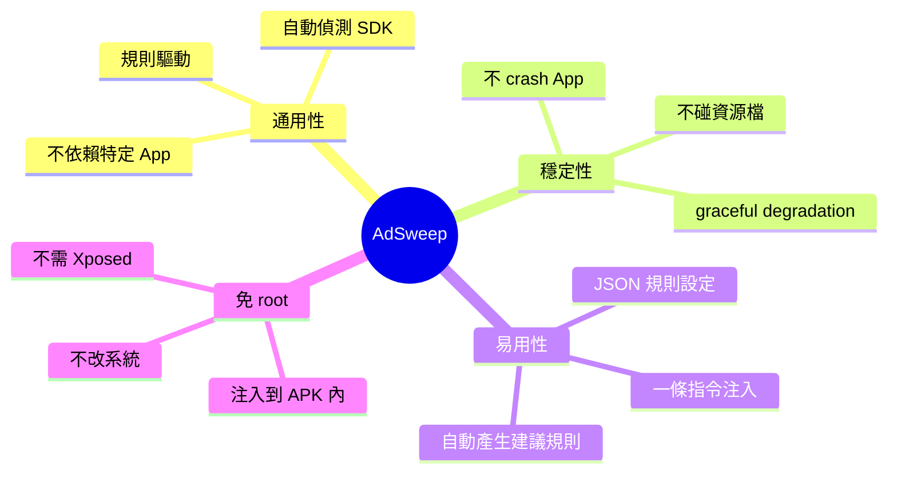

## 技術選型演進

### Hook 引擎

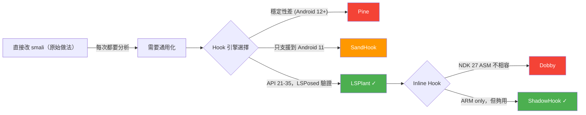

### 反編譯模式

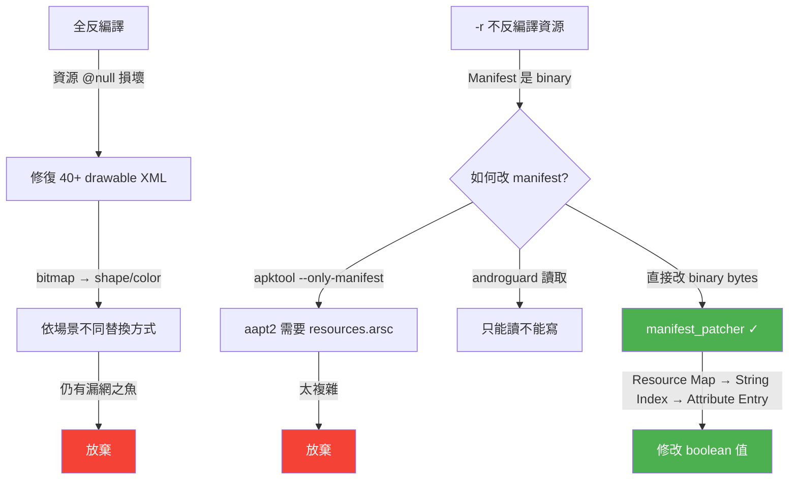

### Layer 3 演進

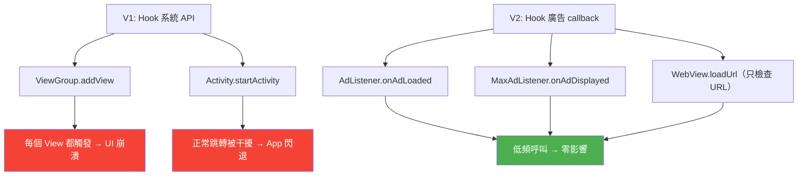

## 規則設計教訓

### Hook 是全局的

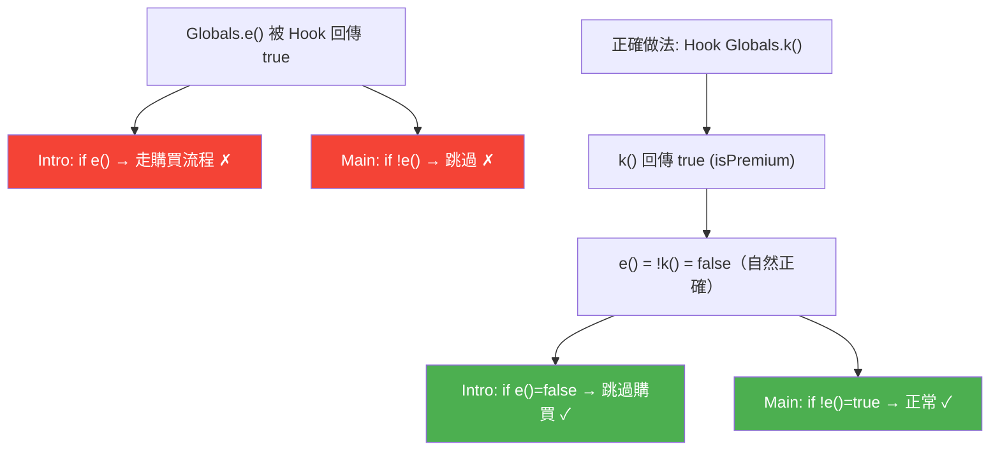

### 不要 Hook callback 觸發方法

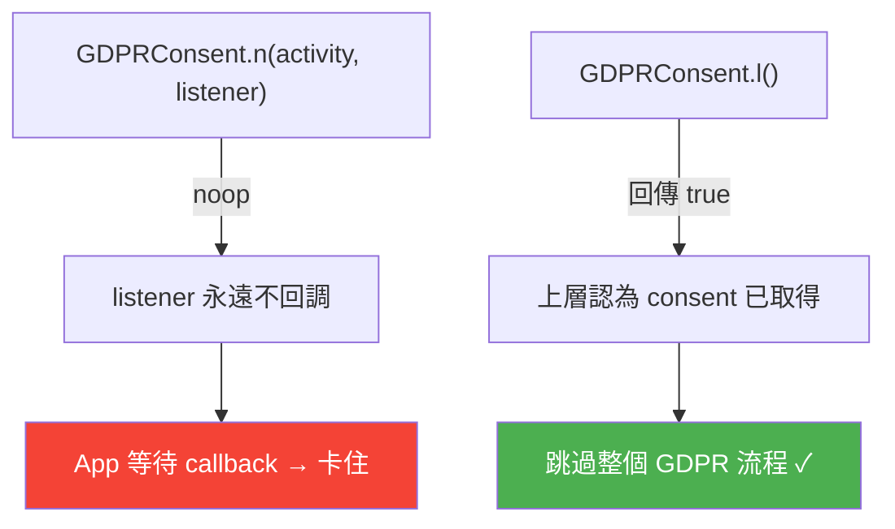

## On-Device Patching 設計演進

### DexPatcher 演進

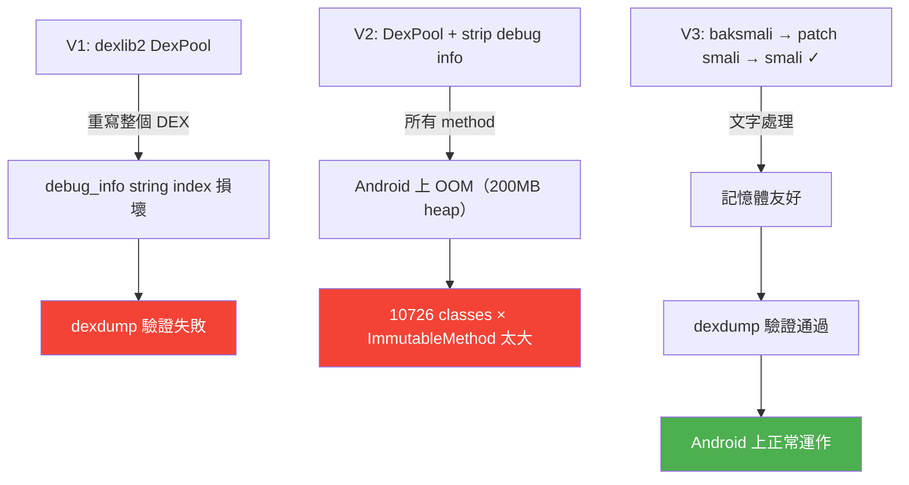

**關鍵教訓：** dexlib2 DexPool 在 intern 大量 class 時會損壞 debug info 的 string index，且在 Android 有限的 heap 上 OOM。baksmali/smali 文字流程雖然慢（~50 秒 vs ~15 秒），但穩定且記憶體友好。

### ZIP STORED 問題

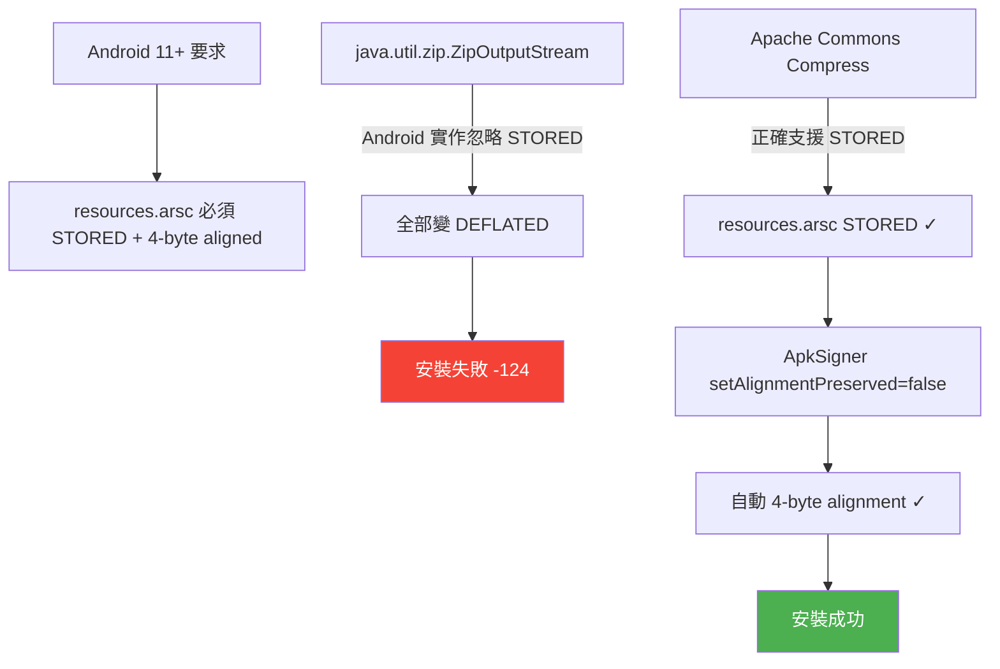

### PatchEngine 記憶體優化

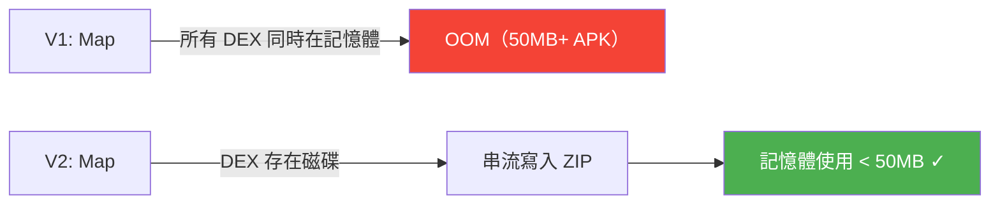

## 效能考量

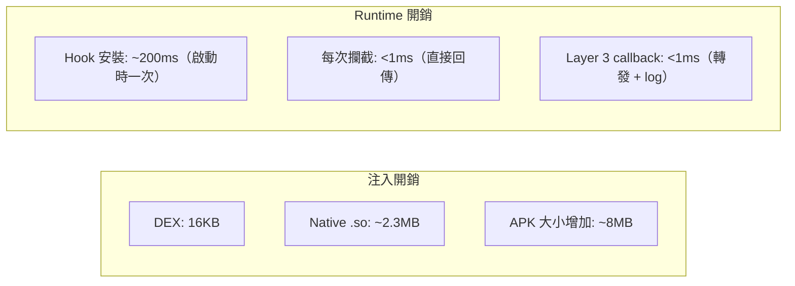

## 與其他方案的比較

## 開發時程

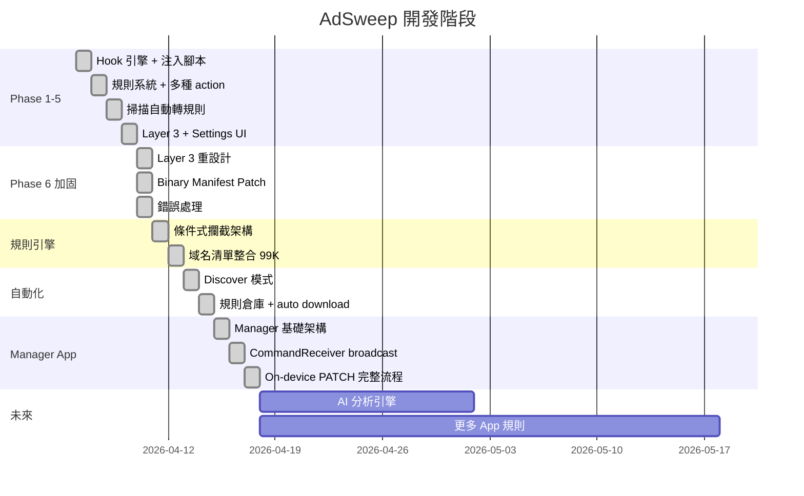
