# AdSweep 待考慮事項與建議

全面檢視設計、應用、實作、商業四個面向的缺口，附帶建議做法和優缺點分析。

## 設計面

### 1. 規則版本遷移

規則 JSON 格式升級時（例如加入 `condition` 欄位），舊規則要能繼續用。

**建議：** 語意版本 + 自動遷移

```json
{
  "formatVersion": 2,
  "rules": [...]
}
```

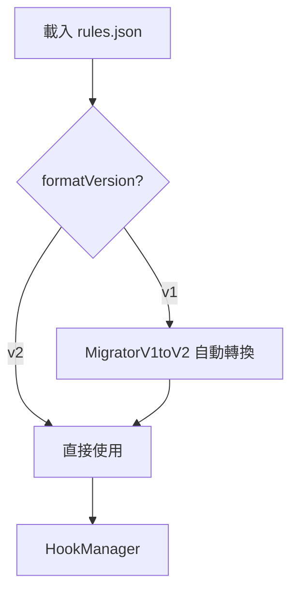

| 方案 | 優點 | 缺點 |
|------|------|------|
| 自動遷移（推薦） | 舊規則無感升級 | 每次升級要寫 migrator |
| 拒絕載入舊版本 | 實作簡單 | 用戶體驗差，規則失效 |
| 同時支援多版本 | 最靈活 | 代碼複雜度高 |

### 2. 規則衝突解決

同一個方法被多條規則匹配時的處理。

**建議：** Priority 數字越大越優先，相同 priority 按來源排序

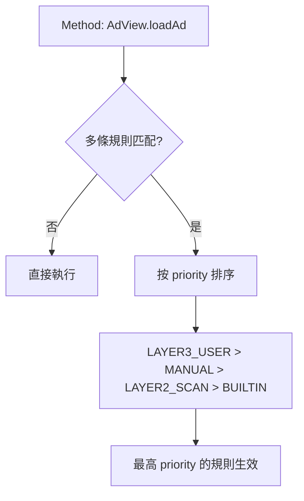

| 來源 | 預設 Priority | 理由 |
|------|--------------|------|
| `LAYER3_USER` | 100 | 用戶明確判斷，最高優先 |
| `MANUAL` | 80 | App 專屬規則 |
| `LAYER2_SCAN` | 60 | 自動掃描建議 |
| `BUILTIN` | 40 | 通用規則 |

### 3. 規則驗證

注入前檢查規則是否有效。

**建議：** inject.py 加入 `--validate` 階段

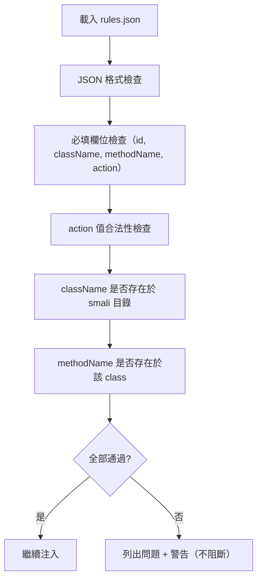

| 方案 | 優點 | 缺點 |
|------|------|------|
| 注入時自動驗證（推薦） | 早期發現問題 | 增加注入時間 |
| 單獨 `--validate` 指令 | 不影響正常流程 | 用戶可能忘記跑 |
| Runtime 驗證 | 最準確（可驗證 ClassLoader） | 發現太晚 |

### 4. 規則除錯

用戶需要知道為什麼某條規則沒生效。

**建議：** 增加 `--verbose` log 等級

```
# 正常 log
I AdSweep.HookManager: Hooked: AdView.loadAd [BLOCK_RETURN_VOID]

# Verbose log（--verbose 或 debug build）
D AdSweep.HookManager: Rule[admob-load] className=BaseAdView → ClassLoader.loadClass → FOUND
D AdSweep.HookManager: Rule[admob-load] methodName=loadAd paramTypes=[AdRequest] → FOUND
D AdSweep.HookManager: Rule[admob-load] HookEngine.hook → SUCCESS, backup=Method@0x1234
D AdSweep.HookManager: Rule[unity-init] className=UnityAds → ClassNotFoundException (SDK not present)
```

| 方案 | 優點 | 缺點 |
|------|------|------|
| Log 等級分層（推薦） | 簡單，用 logcat 過濾 | 需要 adb 才能看 |
| SettingsActivity 裡顯示 | 不需 adb | 開發量大 |
| 寫入檔案 | 可分享給別人分析 | 佔空間 |

### 5. Rollback 機制

規則導致 App crash 時自動恢復。

**建議：** Crash 計數器 + 自動停用

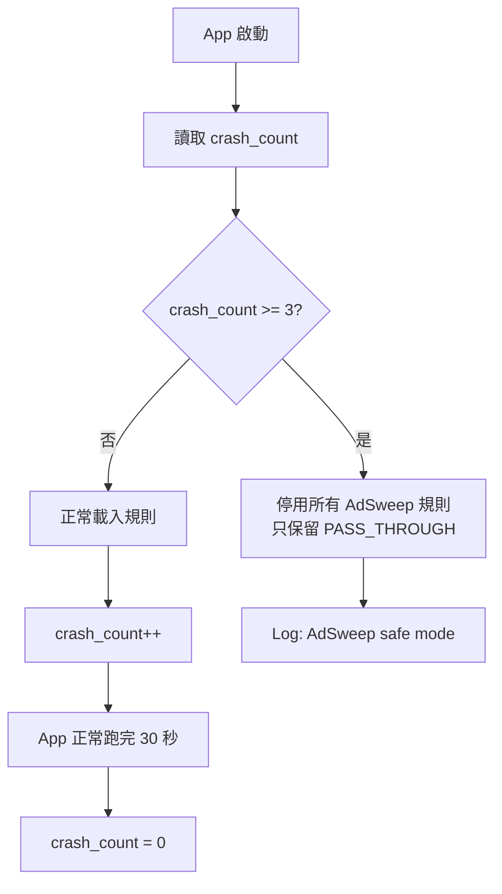

| 方案 | 優點 | 缺點 |
|------|------|------|
| Crash 計數 + safe mode（推薦） | 自動恢復，不需用戶介入 | 實作要用 SharedPreferences |
| 用戶手動停用 | 簡單 | 如果 App 一直 crash 進不去設定 |
| 每條規則獨立計數 | 精確停用問題規則 | 複雜 |

## 應用面

### 6. 多進程 App

有些 App 有多個 process，每個都會初始化 `Application.onCreate`。

**建議：** 只在主進程初始化

```java
public static void init(Context context) {
    // 只在主進程執行
    String processName = getProcessName(context);
    if (!context.getPackageName().equals(processName)) {
        Log.i(TAG, "Skipping non-main process: " + processName);
        return;
    }
    // ... 正常初始化
}
```

| 方案 | 優點 | 缺點 |
|------|------|------|
| 只 Hook 主進程（推薦） | 避免重複 Hook、減少問題 | 子進程的廣告不攔截 |
| 所有進程都 Hook | 覆蓋最全 | 規則可能在子進程有副作用 |
| 可設定（per-rule） | 最靈活 | 複雜 |

### 7. WebView 類型

不同 WebView 實作的 URL 攔截點不同。

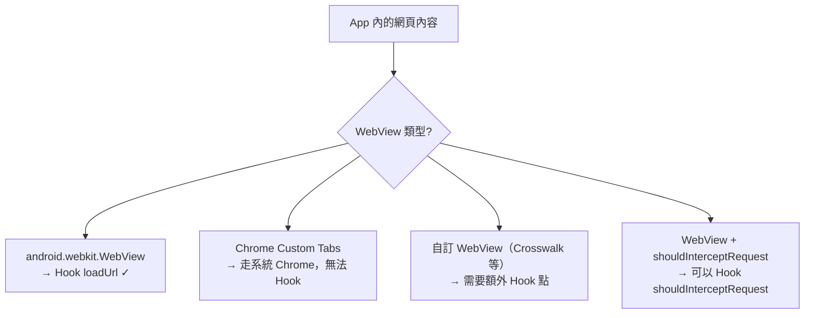

**建議：** 優先 Hook `WebViewClient.shouldInterceptRequest`（比 `loadUrl` 更全面）

| 方案 | 優點 | 缺點 |
|------|------|------|
| Hook shouldInterceptRequest（推薦） | 攔截所有子資源請求 | 需要 WebViewClient 存在 |
| Hook loadUrl（目前） | 簡單 | 只攔截主頁載入 |
| 兩者都 Hook | 最全面 | 可能重複攔截 |

### 8. 加固 App

360 加固、騰訊樂固等殼保護會加密 DEX。

**建議：** 偵測 + 提示，不自動脫殼

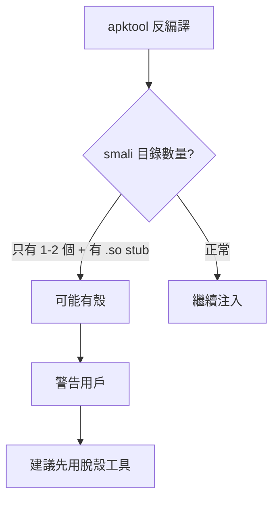

| 方案 | 優點 | 缺點 |
|------|------|------|
| 偵測 + 提示（推薦） | 不增加法律風險 | 用戶需要自己脫殼 |
| 內建脫殼 | 一站式 | 法律風險高、技術難度大 |
| 不處理 | 最簡單 | 用戶困惑為什麼不生效 |

### 9. AAB (Android App Bundle)

Google Play 越來越多用 AAB 而非 APK。

**建議：** 支援 `bundletool` 轉換

```bash
# inject.py 自動偵測 .aab 輸入
python inject.py --apk app.aab
# 內部流程: bundletool build-apks → 提取 base APK → 注入 → 重新打包
```

| 方案 | 優點 | 缺點 |
|------|------|------|
| 支援 bundletool 轉換（推薦） | 覆蓋新格式 | 需要額外依賴 |
| 只支援 APK | 簡單 | 排除越來越多的 App |
| 教用戶自己轉 | 不用寫代碼 | 門檻高 |

### 10. 用戶引導

第一次使用的流程。

**建議：** 分技術/非技術用戶

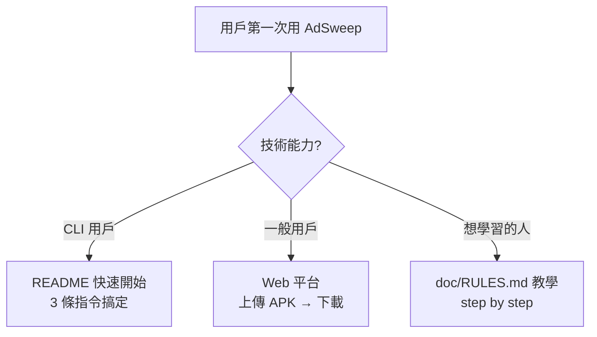

## 實作面

### 11. CI/CD

自動化建置和發佈。

**建議：** GitHub Actions

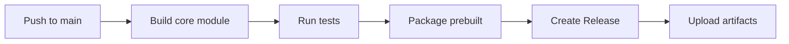

```yaml
# .github/workflows/build.yml
on: push
jobs:
  build:
    runs-on: ubuntu-latest
    steps:
      - uses: actions/setup-java@v4
      - run: ./gradlew :core:assembleRelease
      - run: # package prebuilt
      - uses: actions/upload-artifact@v4
```

| 方案 | 優點 | 缺點 |
|------|------|------|
| GitHub Actions（推薦） | 免費、跟 repo 整合 | Android NDK 建置較慢 |
| 本地建置 + 手動發佈 | 無需設定 | 依賴個人環境 |

### 12. 自動化測試

怎麼驗證 Hook 是否生效。

**建議：** 分層測試

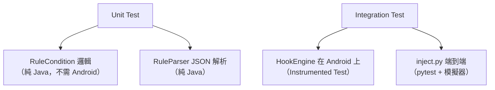

| 層級 | 工具 | 覆蓋 |
|------|------|------|
| Unit | JUnit | Condition/Action/Parser |
| Integration | Android Instrumented Test | Hook 引擎 |
| E2E | pytest + adb | 完整注入流程 |

### 13. 大域名清單的記憶體

5 萬個域名的 HashSet 佔多少記憶體。

**估算：**
```
平均域名長度 ~20 字元 = 40 bytes (UTF-16)
String 物件開銷 ~40 bytes
HashSet Entry 開銷 ~32 bytes
每條約 112 bytes × 50,000 = ~5.3 MB
```

| 方案 | 記憶體 | 查詢速度 | 建議 |
|------|--------|---------|------|
| HashSet（推薦） | ~5 MB | O(1) | 大部分手機可接受 |
| Bloom Filter | ~600 KB | O(1) 但有誤判 | 記憶體敏感時 |
| 排序陣列 + 二分搜尋 | ~3 MB | O(log n) | 折衷方案 |
| SQLite | ~2 MB（disk） | O(log n) | 最省記憶體但最慢 |

5MB 對現代手機（4-8 GB RAM）不是問題。推薦直接用 HashSet。

### 14. Thread Safety

多執行緒呼叫被 Hook 方法時的安全性。

**建議：** 已有的 `AtomicInteger` 計數 + `volatile` 時間戳足夠

```java
// 已在 HookRule 設計中包含
private final AtomicInteger hitCount = new AtomicInteger(0);  // thread-safe
private volatile long lastHitTime = 0;  // thread-safe read/write
```

| 需要注意的地方 | 做法 |
|---------------|------|
| 統計計數 | AtomicInteger（已設計） |
| 規則開關 | volatile boolean |
| 域名 Set | 載入後不修改 → 天然 thread-safe |
| 規則熱更新 | CopyOnWriteArrayList 或 volatile reference swap |

### 15. AdSweep 自身的混淆

`com.adsweep` 太明顯，有些 App 可能偵測。

**建議：** inject.py 支援 `--obfuscate` 參數

```bash
python inject.py --apk app.apk --obfuscate
# 將 com.adsweep 重命名為隨機 package name
# e.g., com.a1b2c3.x4y5z6
```

| 方案 | 優點 | 缺點 |
|------|------|------|
| 注入時隨機重命名（推薦） | 每次注入不同名字 | 需要改 smali 的 class 引用 |
| 固定偽裝名（如 `com.android.support.internal`） | 簡單 | 容易被針對 |
| 不處理 | 最簡單 | 被偵測風險 |

實作：baksmali → rename package → 修改所有 smali 的 class 引用 + AndroidManifest。

### 16. ProGuard/R8 相容

目標 App 的混淆不會影響 AdSweep 的注入，因為我們是額外加入的 DEX。但要注意：

- AdSweep 自己的 class 不能被 App 的 R8 混淆（我們是獨立 DEX）→ **不受影響** ✓
- 規則裡的 className 必須是混淆後的名稱（如 `a.b.c` 而不是原始名）→ 已經是這樣 ✓
- 唯一風險：App 更新後混淆 mapping 變化 → 版本檢查機制處理

## 商業面

### 17. 開源授權選擇

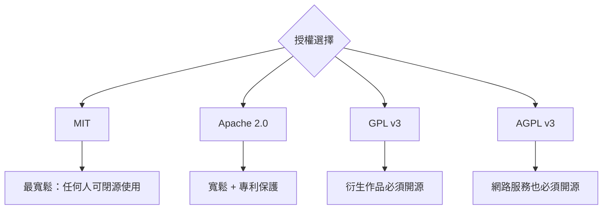

| 授權 | 優點 | 缺點 | 適合 |
|------|------|------|------|
| **Apache 2.0（推薦）** | 寬鬆 + 專利授權 + 企業友善 | 別人可以閉源 fork | 想建立生態、吸引企業 |
| MIT | 最簡單、最寬鬆 | 沒有專利保護 | 個人專案 |
| GPL v3 | 強制開源衍生作品 | 嚇跑企業用戶 | 想確保永遠開源 |
| AGPL v3 | SaaS 也要開源 | 最嚴格，嚇跑所有商業用戶 | 不適合 |

推薦 **Apache 2.0**：比 MIT 多了專利保護（防止有人用你的代碼申請專利再告你），又不像 GPL 嚇跑企業。ReVanced 也用 GPL，但那是因為他們不想被商業化。AdSweep 如果要走 SaaS 平台，Apache 2.0 更合適。

### 18. 隱私政策

AdSweep 作為隱私工具，自身的隱私政策必須透明。

**建議：** 零收集原則

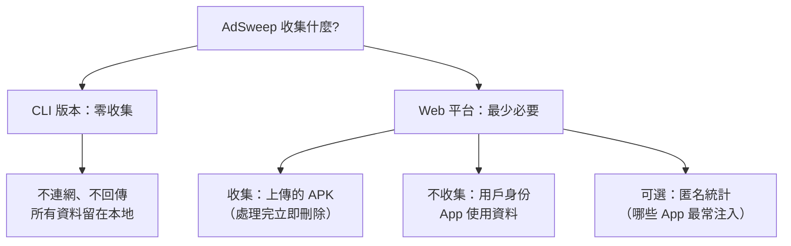

| 資料 | CLI | Web 平台 | 處理方式 |
|------|-----|---------|---------|
| APK 檔案 | 不經過伺服器 | 上傳後處理完刪除 | 不留存 |
| 規則 JSON | 本地 | 本地 | 不回傳 |
| 攔截統計 | logcat only | 不收集 | 不回傳 |
| Crash log | logcat only | 可選匿名回報 | opt-in |

### 19. 社群管理

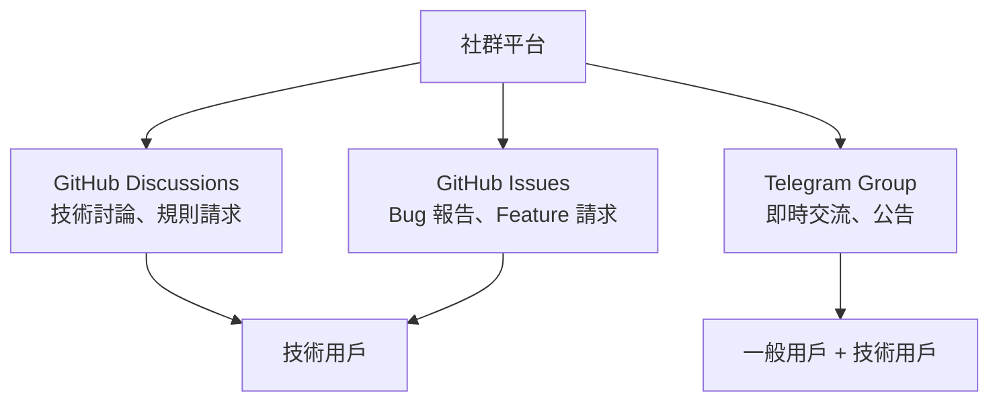

| 平台 | 優點 | 缺點 | 建議用途 |
|------|------|------|---------|
| **GitHub Discussions（推薦主力）** | 跟代碼在一起、可搜尋 | 門檻稍高 | 技術討論、規則請求 |
| **Telegram** | 即時、門檻低 | 內容會被沖掉 | 公告、快速交流 |
| Discord | 頻道分類好 | 需要管理 | 如果社群夠大再開 |
| Reddit | 曝光度高 | 不可控 | 推廣用，不做主力 |

### 20. 合作機會

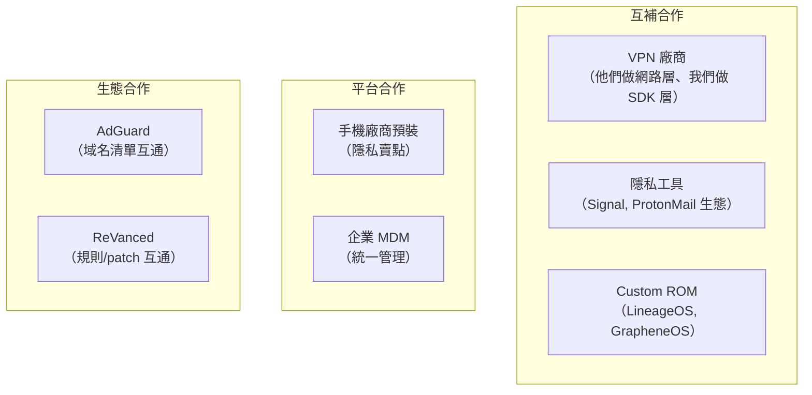

| 合作對象 | 合作方式 | 價值 | 可行性 |
|---------|---------|------|--------|
| **AdGuard（推薦優先）** | 域名清單整合 | 立即獲得 5 萬+ 規則 | 高（開源清單） |
| VPN 廠商 | 捆綁銷售 | 雙方用戶互導 | 中 |
| Custom ROM | 預裝 | 精準用戶群 | 中 |
| ReVanced | 規則互通 | 社群共享 | 低（格式差異大） |

### 21. 品牌保護

**建議：** 先註冊商標再開源

| 行動 | 時機 | 成本 |
|------|------|------|
| GitHub Organization（`adsweep`） | 現在 | 免費 |
| 域名（adsweep.org / adsweep.io） | 現在 | ~$15/年 |
| 台灣商標 | 開源前 | ~$3,000-5,000 NTD |
| 美國商標 | 有營收後 | ~$250-350 USD |

先搶域名和 GitHub org，商標等有預算再做。

## 行動優先順序總覽

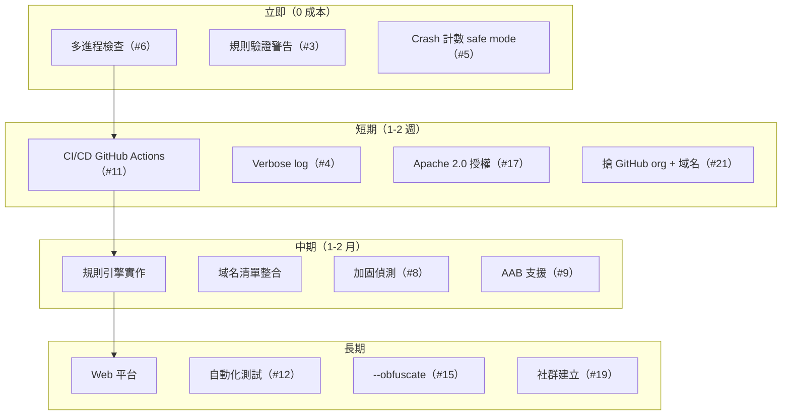
