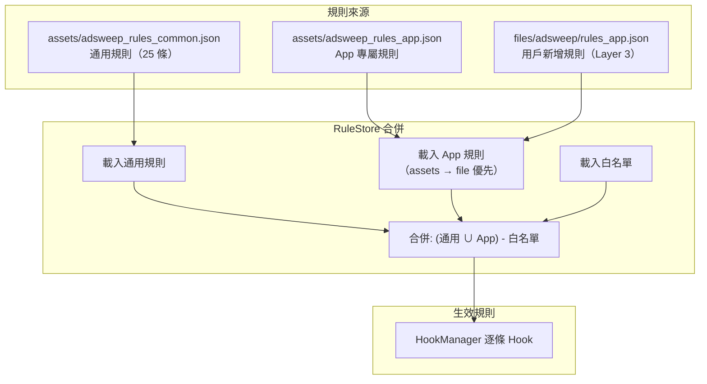
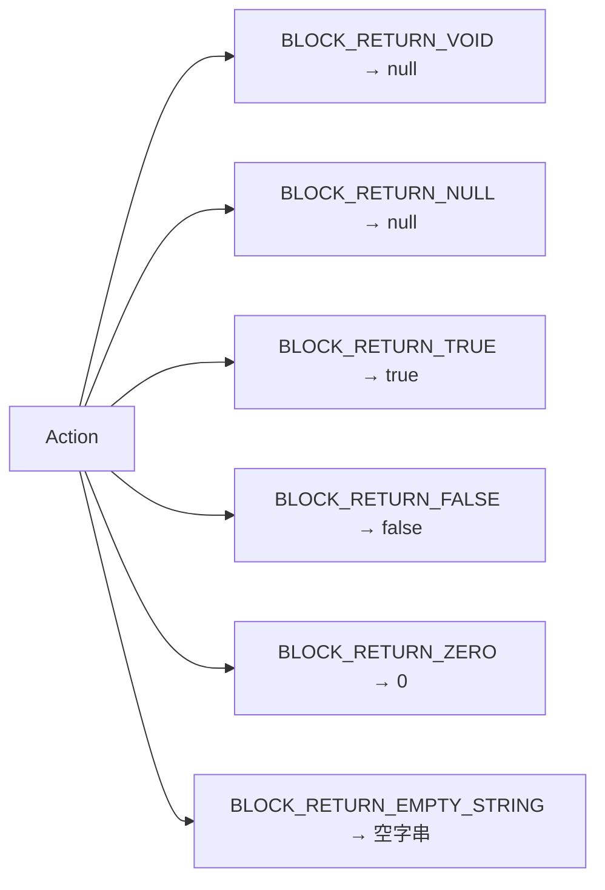
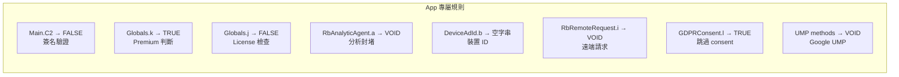

# AdSweep 規則系統

## 規則架構



## 規則類型

### 通用規則 (`adsweep_rules_common.json`)

內建在 `assets/` 裡，涵蓋 14 個常見廣告 SDK + Google UMP，共 25 條規則。

### App 專屬規則 (`adsweep_rules_app.json`)

注入時透過 `--rules` 參數提供：

```bash
python inject.py --apk app.apk --rules rules/my_app.json
```

### 自動建議規則

Layer 2 掃描自動產生 `suggested_rules.json`：

```bash
# 第一次注入，查看建議規則
python inject.py --apk app.apk --keep-work
cat work/suggested_rules.json

# 確認後作為 App 規則使用
python inject.py --apk app.apk --rules work/suggested_rules.json
```

## 規則格式

```json
{
  "version": 1,
  "rules": [
    {
      "id": "unique-rule-id",
      "className": "com.example.ads.AdManager",
      "methodName": "loadAd",
      "paramTypes": ["android.content.Context"],
      "action": "BLOCK_RETURN_VOID",
      "enabled": true,
      "source": "BUILTIN",
      "sdkName": "Example SDK",
      "notes": "Optional description"
    }
  ]
}
```

### 欄位說明

| 欄位 | 必填 | 說明 |
|------|------|------|
| `id` | 是 | 唯一識別碼 |
| `className` | 是 | 完整 Java class 名稱 |
| `methodName` | 是 | 方法名稱 |
| `paramTypes` | 否 | 方法參數型別陣列。省略時匹配同名的第一個方法 |
| `action` | 是 | 攔截行為（見下表） |
| `enabled` | 否 | 是否啟用（預設 true） |
| `source` | 否 | 來源：BUILTIN / MANUAL / LAYER2_SCAN / LAYER3_USER |
| `sdkName` | 否 | 人類可讀的 SDK 名稱 |
| `notes` | 否 | 備註 |

### Action 類型



| Action | 回傳值 | 適用場景 |
|--------|--------|---------|
| `BLOCK_RETURN_VOID` | null | void 方法（廣告初始化、載入） |
| `BLOCK_RETURN_NULL` | null | 回傳 Object 的方法 |
| `BLOCK_RETURN_TRUE` | true | 繞過檢查（premium 判斷、consent 已取得） |
| `BLOCK_RETURN_FALSE` | false | 繞過檢查（簽名驗證） |
| `BLOCK_RETURN_ZERO` | 0 | 回傳數值的方法 |
| `BLOCK_RETURN_EMPTY_STRING` | "" | 回傳字串的方法（裝置 ID） |

## 寫規則的注意事項

### Hook 是全局的

Hook 一個方法後，**所有呼叫點**都會被攔截。如果一個方法在不同位置有不同分支邏輯，直接 Hook 可能導致異常。

**解決方式：Hook 更底層的方法。**

```
錯誤：Hook e() 回傳 false
  → Intro 用 e() 判斷購買流程（if-eqz → 跳過）✓
  → 但其他地方用 if-nez 判斷（邏輯反了）✗

正確：Hook k()（e 的底層）回傳 true
  → e() = !k() = false（自然正確）
  → 所有呼叫點行為一致 ✓
```

### 不要 Hook callback 觸發方法

如果方法 A 接收一個 callback 參數，noop A 會導致 callback 永遠不觸發。

```
錯誤：Hook GDPRConsent.n(activity, listener) → listener 永遠不回調 → App 卡住
正確：Hook GDPRConsent.l() → 回傳 true（consent 已取得）→ 跳過整個流程
```

### 注意方法所在的 class

方法可能定義在父類別，不在你看到的 class 上。

```
錯誤：Hook AdView.loadAd → 找不到（AdView 沒有 loadAd）
正確：Hook BaseAdView.loadAd → 成功（loadAd 定義在父類別）
```

檢查 smali 的 `.super` 宣告來找父類別。

## 自訂規則教學

### 1. 找到目標方法

```bash
apktool d -r target.apk -o decompiled
grep -r "loadAd\|showAd\|initAd" decompiled/smali*/
```

### 2. 確認方法簽名

```smali
.method public loadAd(Lcom/example/AdRequest;)V   ← void 方法
.method public static isValid()Z                    ← 回傳 boolean
.method public getId()Ljava/lang/String;            ← 回傳 String
```

### 3. 寫規則

```json
{
  "id": "my-custom-rule",
  "className": "com.example.MyClass",
  "methodName": "loadAd",
  "paramTypes": ["com.example.AdRequest"],
  "action": "BLOCK_RETURN_VOID",
  "enabled": true,
  "source": "MANUAL",
  "sdkName": "Custom"
}
```

### 4. 注入

```bash
python inject.py --apk target.apk --rules my_rules.json
```

## 範例：Money Manager 規則



| 規則 | Class | Method | Action | 用途 |
|------|-------|--------|--------|------|
| 簽名驗證 | Main | C2 | BLOCK_RETURN_FALSE | 跳過簽名檢查 |
| Premium | Globals | k | BLOCK_RETURN_TRUE | isPremium=true, e()=false |
| License | Globals | j | BLOCK_RETURN_FALSE | 跳過授權檢查 |
| Analytics | RbAnalyticAgent | a | BLOCK_RETURN_VOID | 封堵追蹤 |
| Device ID | DeviceAdId | b | BLOCK_RETURN_EMPTY_STRING | 不回傳裝置 ID |
| Remote API | RbRemoteRequest | i | BLOCK_RETURN_VOID | 封堵雲端請求 |
| GDPR | GDPRConsent | l | BLOCK_RETURN_TRUE | 跳過 consent |
| UMP | UserMessagingPlatform | loadAndShowConsentFormIfRequired | BLOCK_RETURN_VOID | 封堵 UMP |
| UMP | UserMessagingPlatform | loadConsentForm | BLOCK_RETURN_VOID | 封堵 UMP |

## 通用規則清單

### AdMob (5 rules)
- `BaseAdView.loadAd` — Banner 廣告（注意：在父類別 BaseAdView，不是 AdView）
- `InterstitialAd.load` — 插頁廣告
- `RewardedAd.load` — 獎勵廣告
- `AdLoader.loadAd` — Native 廣告
- `MobileAds.initialize` — SDK 初始化

### AppLovin (3 rules)
- `AppLovinSdk.initialize` — SDK 初始化
- `MaxAdView.loadAd` — Banner
- `MaxInterstitialAd.loadAd` — 插頁

### Facebook Audience Network (2 rules)
- `AdView.loadAd` — Banner
- `InterstitialAd.loadAd` — 插頁

### IronSource (2 rules)
- `IronSource.loadISDemandOnlyInterstitial` — 插頁
- `IronSource.loadISDemandOnlyRewardedVideo` — 獎勵

### Kakao AdFit (1 rule)
- `BannerAdView.loadAd` — Banner

### Google UMP (2 rules)
- `UserMessagingPlatform.loadAndShowConsentFormIfRequired` — GDPR consent
- `UserMessagingPlatform.loadConsentForm` — consent 表單

### 其他（App 沒有時自動跳過）
Unity Ads, Vungle, AdColony, InMobi, Chartboost, MoPub, Coupang Ads, StartApp, Pangle
