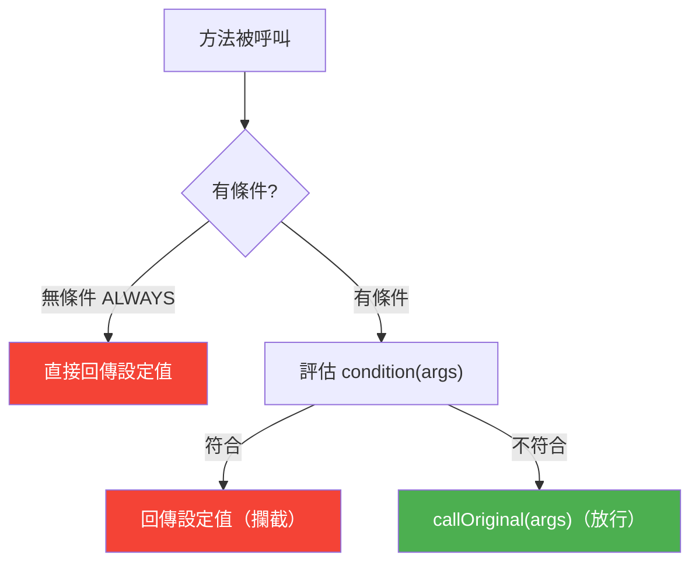
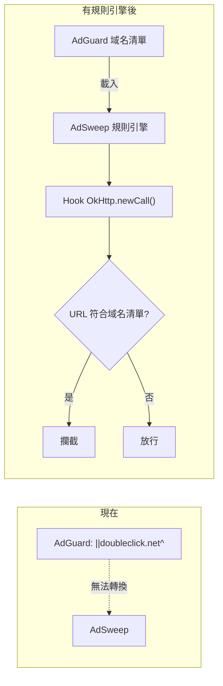
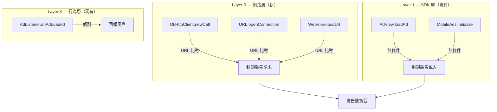
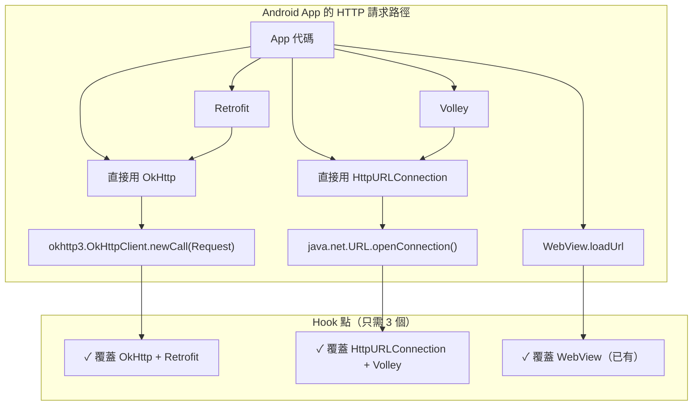
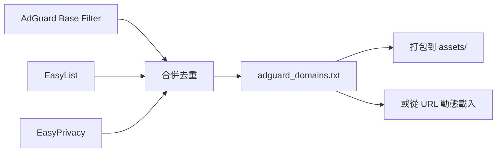
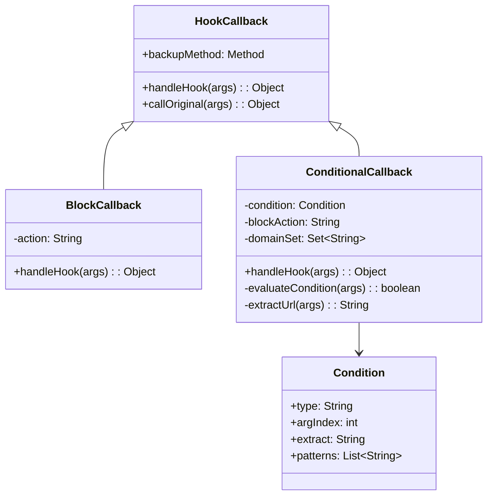
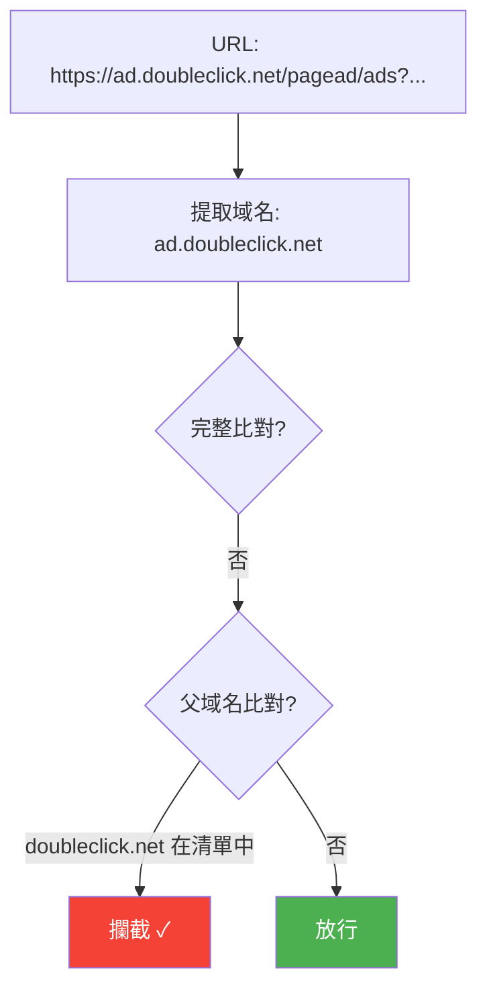
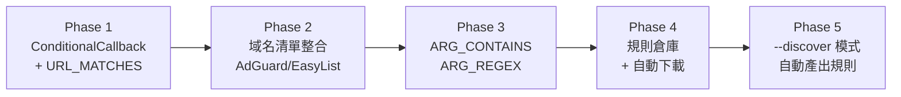

# AdSweep 規則引擎設計（未實作）

## 背景

目前的 `BlockCallback` 只做無條件攔截：方法被呼叫 → 回傳固定值。
這限制了 AdSweep 只能攔截「已知的廣告方法」，無法做更細緻的判斷。

規則引擎的目標是讓 AdSweep 能做**條件式攔截**：
檢查方法的參數內容，符合條件才攔截，否則放行。

這樣就能整合 AdGuard/EasyList 等現有的幾十萬條域名規則。

## 核心概念



```
目前（靜態）:  rule → match class + method → 固定 action
未來（動態）:  rule → match class + method → 檢查條件 → 決定 action
```

## 為什麼需要

### URL 級別攔截

AdGuard/EasyList 有幾十萬條域名規則。目前 AdSweep 不能直接用。
有了規則引擎，只需要 Hook HTTP client 的方法，然後用域名清單做參數檢查。



### 統一不同層級的攔截



## 條件類型

| 條件 type | 說明 | 用途 |
|-----------|------|------|
| `ALWAYS` | 無條件（現有行為） | SDK 方法攔截 |
| `URL_MATCHES` | 參數中的 URL 比對域名清單 | 網路請求攔截 |
| `ARG_CONTAINS` | 參數包含特定字串 | 檢查 ad unit ID 等 |
| `ARG_EQUALS` | 參數等於特定值 | 精確比對 |
| `ARG_REGEX` | 參數正則比對 | 複雜模式 |
| `CALLER_MATCHES` | call stack 包含特定 class | 只攔截從廣告 SDK 發起的呼叫 |

## 規則格式擴充

### 現有格式（無條件）

```json
{
  "id": "admob-adview-load",
  "className": "com.google.android.gms.ads.BaseAdView",
  "methodName": "loadAd",
  "action": "BLOCK_RETURN_VOID",
  "enabled": true
}
```

### 擴充格式（有條件）

```json
{
  "id": "network-block-ad-domains",
  "className": "okhttp3.OkHttpClient",
  "methodName": "newCall",
  "condition": {
    "type": "URL_MATCHES",
    "argIndex": 0,
    "extract": "url",
    "source": "adguard_domains.txt"
  },
  "action": "BLOCK_RETURN_NULL",
  "elseAction": "PASS_THROUGH",
  "enabled": true
}
```

### 欄位說明

| 欄位 | 說明 |
|------|------|
| `condition` | 攔截條件（省略時等同 `ALWAYS`，向後相容） |
| `condition.type` | 條件類型 |
| `condition.argIndex` | 檢查第幾個參數（0 = this，1 = 第一個參數） |
| `condition.extract` | 從參數物件提取什麼（`url`、`toString`、`field:name`） |
| `condition.source` | 比對清單來源（域名清單檔案、內嵌陣列等） |
| `condition.patterns` | 內嵌的比對模式（替代 source） |
| `elseAction` | 條件不符合時的行為（`PASS_THROUGH` = 呼叫原始方法） |

## 需要 Hook 的 HTTP Client



| Hook 點 | Class | Method | 參數取 URL 方式 |
|---------|-------|--------|----------------|
| OkHttp | `okhttp3.OkHttpClient` | `newCall` | `arg.url().toString()` |
| HttpURLConnection | `java.net.URL` | `openConnection` | `this.toString()` |
| WebView | `android.webkit.WebView` | `loadUrl` | `arg` (直接是 String) |

只需要 Hook 3 個方法，就能攔截 App 裡幾乎所有網路請求。

## 域名清單整合

### 來源



### 格式轉換

```
AdGuard 格式:          AdSweep 域名清單:
||doubleclick.net^     doubleclick.net
||googlesyndication.com^ googlesyndication.com
||facebook.com/tr^     facebook.com
@@||example.com^       （白名單，不匯入）
```

轉換規則：
1. 提取 `||` 和 `^` 之間的域名
2. 去除子路徑（只保留域名部分）
3. 忽略白名單規則（`@@`）
4. 忽略非域名規則（CSS selectors、scriptlets 等）
5. 去重排序

### 預估規模

| 清單 | 規則數 | 提取域名數（估計） |
|------|--------|-------------------|
| AdGuard Base | ~60,000 | ~15,000 |
| EasyList | ~90,000 | ~20,000 |
| EasyPrivacy | ~30,000 | ~10,000 |
| 合併去重後 | — | ~30,000 |

30,000 個域名，用 HashSet 存在記憶體中，查詢是 O(1)，對效能幾乎無影響。

## 架構變化

### Callback 層級



### 現有 vs 新增

```
現有（不變）:
  BlockCallback — 無條件攔截，處理 ALWAYS 類型的規則

新增:
  ConditionalCallback — 條件式攔截，處理有 condition 的規則
  Condition — 條件評估器
  DomainMatcher — 域名比對（HashSet + 子域名匹配）
```

## ConditionalCallback 虛擬碼

```java
public class ConditionalCallback extends HookCallback {
    private Condition condition;
    private String blockAction;
    private Set<String> domainSet;  // 載入的域名清單

    @Override
    public Object handleHook(Object[] args) {
        // 評估條件
        if (evaluateCondition(args)) {
            // 條件符合 → 攔截
            Log.i(TAG, "Blocked: " + description);
            return getReturnValue(blockAction);
        } else {
            // 條件不符合 → 放行
            return callOriginal(args);
        }
    }

    private boolean evaluateCondition(Object[] args) {
        switch (condition.type) {
            case "URL_MATCHES":
                String url = extractUrl(args);
                return url != null && domainSet.contains(extractDomain(url));

            case "ARG_CONTAINS":
                String argStr = extractArg(args);
                return argStr != null && condition.patterns.stream()
                    .anyMatch(argStr::contains);

            case "ARG_REGEX":
                String argVal = extractArg(args);
                return argVal != null && condition.compiledPattern.matcher(argVal).find();

            default:
                return true;  // ALWAYS
        }
    }

    private String extractUrl(Object[] args) {
        Object arg = args[condition.argIndex];
        // OkHttp: Request.url().toString()
        // URL: this.toString()
        // WebView: arg is String directly
        // 用 reflection 嘗試各種方式
        ...
    }
}
```

## 域名比對策略



子域名匹配：`ad.doubleclick.net` 要能匹配到清單中的 `doubleclick.net`。
實作方式：逐層去除子域名查詢 HashSet。

```java
boolean matchesDomain(String domain, Set<String> domainSet) {
    // ad.doubleclick.net → doubleclick.net → net
    while (domain.contains(".")) {
        if (domainSet.contains(domain)) return true;
        domain = domain.substring(domain.indexOf('.') + 1);
    }
    return false;
}
```

## 實作優先順序



1. **Phase 1**: 實作 `ConditionalCallback` + `URL_MATCHES` + Hook OkHttp/URL
2. **Phase 2**: 整合 AdGuard/EasyList 域名清單
3. **Phase 3**: 支援 `ARG_CONTAINS` / `ARG_REGEX` 等通用條件
4. **Phase 4**: 規則倉庫 + `--rules-url auto` 自動下載
5. **Phase 5**: `--discover` 模式，自動產出已驗證的規則

## 向後相容

規則格式向後相容——沒有 `condition` 欄位的規則等同 `ALWAYS` 條件：

```json
// 舊格式（繼續運作）
{"className": "AdView", "methodName": "loadAd", "action": "BLOCK_RETURN_VOID"}

// 新格式
{"className": "OkHttpClient", "methodName": "newCall", "action": "BLOCK_RETURN_NULL",
 "condition": {"type": "URL_MATCHES", "source": "adguard_domains.txt"}}
```

`HookManager` 根據有無 `condition` 選擇使用 `BlockCallback` 或 `ConditionalCallback`。
