# AdSweep 規則引擎設計（未實作）

## 背景

目前的 `BlockCallback` 只做無條件攔截：方法被呼叫 → 回傳固定值。
這限制了 AdSweep 只能攔截「已知的廣告方法」，無法做更細緻的判斷。

規則引擎的目標是讓 AdSweep 能做**條件式攔截**：
檢查方法的參數內容，符合條件才攔截，否則放行。

這樣就能整合 AdGuard/EasyList 等現有的幾十萬條域名規則。

## 核心概念

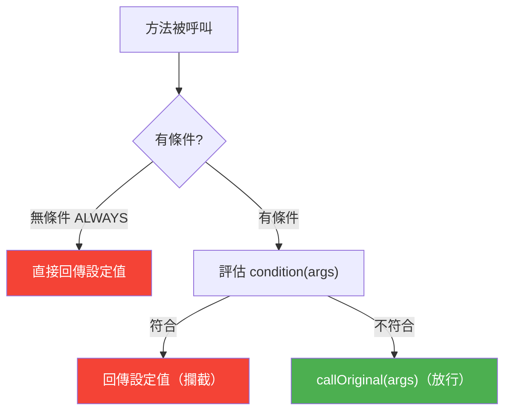
```mermaid
graph TD
    A["方法被呼叫"] --> B{有條件?}
    B -->|無條件 ALWAYS| C["直接回傳設定值"]
    B -->|有條件| D["評估 condition(args)"]
    D -->|符合| E["回傳設定值（攔截）"]
    D -->|不符合| F["callOriginal(args)（放行）"]

    style C fill:#f44336,color:#fff
    style E fill:#f44336,color:#fff
    style F fill:#4CAF50,color:#fff
```

```
目前（靜態）:  rule → match class + method → 固定 action
未來（動態）:  rule → match class + method → 檢查條件 → 決定 action
```

## 為什麼需要

### URL 級別攔截

AdGuard/EasyList 有幾十萬條域名規則。目前 AdSweep 不能直接用。
有了規則引擎，只需要 Hook HTTP client 的方法，然後用域名清單做參數檢查。

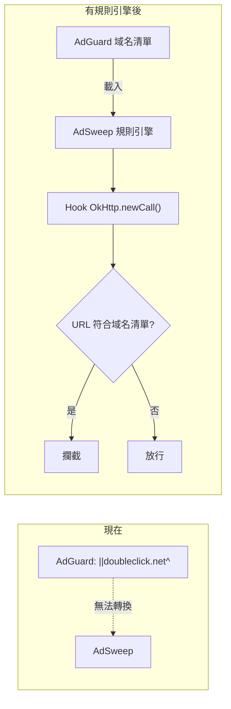
```mermaid
graph LR
    subgraph 現在
        A1["AdGuard: ||doubleclick.net^"] -.->|"無法轉換"| B1["AdSweep"]
    end

    subgraph 有規則引擎後
        A2["AdGuard 域名清單"] -->|"載入"| B2["AdSweep 規則引擎"]
        B2 --> C2["Hook OkHttp.newCall()"]
        C2 --> D2{"URL 符合域名清單?"}
        D2 -->|是| E2["攔截"]
        D2 -->|否| F2["放行"]
    end
```

### 統一不同層級的攔截

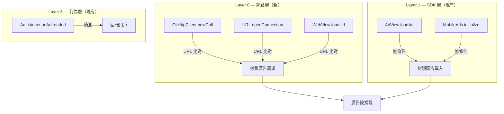
```mermaid
graph TB
    subgraph "Layer 0 — 網路層（新）"
        N1["OkHttpClient.newCall"] -->|"URL 比對"| N2["封鎖廣告請求"]
        N3["URL.openConnection"] -->|"URL 比對"| N2
        N4["WebView.loadUrl"] -->|"URL 比對"| N2
    end

    subgraph "Layer 1 — SDK 層（現有）"
        S1["AdView.loadAd"] -->|"無條件"| S2["封鎖廣告載入"]
        S3["MobileAds.initialize"] -->|"無條件"| S2
    end

    subgraph "Layer 3 — 行為層（現有）"
        B1["AdListener.onAdLoaded"] -->|"偵測"| B2["回報用戶"]
    end

    N2 --> R["廣告被攔截"]
    S2 --> R
```

## 條件類型

| 條件 type | 說明 | 用途 |
|-----------|------|------|
| `ALWAYS` | 無條件（現有行為） | SDK 方法攔截 |
| `URL_MATCHES` | 參數中的 URL 比對域名清單 | 網路請求攔截 |
| `ARG_CONTAINS` | 參數包含特定字串 | 檢查 ad unit ID 等 |
| `ARG_EQUALS` | 參數等於特定值 | 精確比對 |
| `ARG_REGEX` | 參數正則比對 | 複雜模式 |
| `CALLER_MATCHES` | call stack 包含特定 class | 只攔截從廣告 SDK 發起的呼叫 |

## 規則格式擴充

### 現有格式（無條件）

```json
{
  "id": "admob-adview-load",
  "className": "com.google.android.gms.ads.BaseAdView",
  "methodName": "loadAd",
  "action": "BLOCK_RETURN_VOID",
  "enabled": true
}
```

### 擴充格式（有條件）

```json
{
  "id": "network-block-ad-domains",
  "className": "okhttp3.OkHttpClient",
  "methodName": "newCall",
  "condition": {
    "type": "URL_MATCHES",
    "argIndex": 0,
    "extract": "url",
    "source": "adguard_domains.txt"
  },
  "action": "BLOCK_RETURN_NULL",
  "elseAction": "PASS_THROUGH",
  "enabled": true
}
```

### 欄位說明

| 欄位 | 說明 |
|------|------|
| `condition` | 攔截條件（省略時等同 `ALWAYS`，向後相容） |
| `condition.type` | 條件類型 |
| `condition.argIndex` | 檢查第幾個參數（0 = this，1 = 第一個參數） |
| `condition.extract` | 從參數物件提取什麼（`url`、`toString`、`field:name`） |
| `condition.source` | 比對清單來源（域名清單檔案、內嵌陣列等） |
| `condition.patterns` | 內嵌的比對模式（替代 source） |
| `elseAction` | 條件不符合時的行為（`PASS_THROUGH` = 呼叫原始方法） |

## 需要 Hook 的 HTTP Client

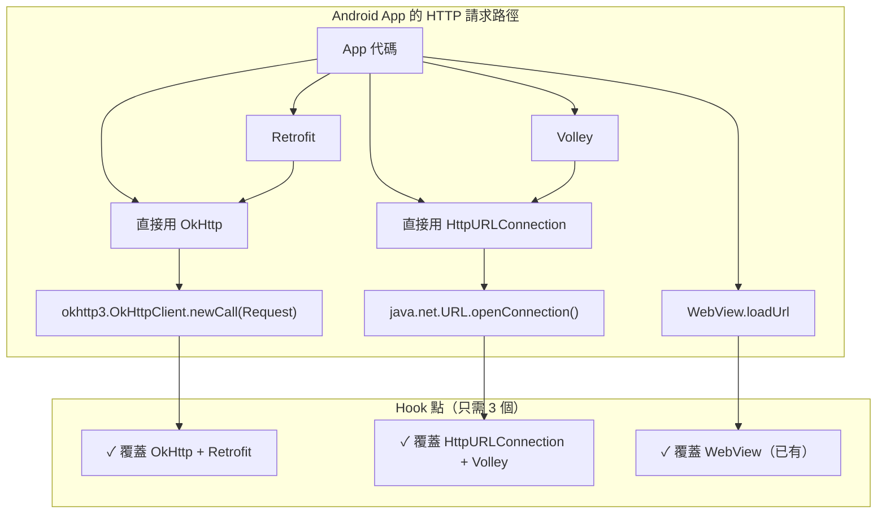
```mermaid
graph TB
    subgraph "Android App 的 HTTP 請求路徑"
        A["App 代碼"] --> B["Retrofit"]
        A --> C["Volley"]
        A --> D["直接用 OkHttp"]
        A --> E["直接用 HttpURLConnection"]
        A --> F["WebView.loadUrl"]

        B --> D
        C --> E
        D --> G["okhttp3.OkHttpClient.newCall(Request)"]
        E --> H["java.net.URL.openConnection()"]
    end

    subgraph "Hook 點（只需 3 個）"
        G --> I["✓ 覆蓋 OkHttp + Retrofit"]
        H --> J["✓ 覆蓋 HttpURLConnection + Volley"]
        F --> K["✓ 覆蓋 WebView（已有）"]
    end
```

| Hook 點 | Class | Method | 參數取 URL 方式 |
|---------|-------|--------|----------------|
| OkHttp | `okhttp3.OkHttpClient` | `newCall` | `arg.url().toString()` |
| HttpURLConnection | `java.net.URL` | `openConnection` | `this.toString()` |
| WebView | `android.webkit.WebView` | `loadUrl` | `arg` (直接是 String) |

只需要 Hook 3 個方法，就能攔截 App 裡幾乎所有網路請求。

## 域名清單整合

### 來源

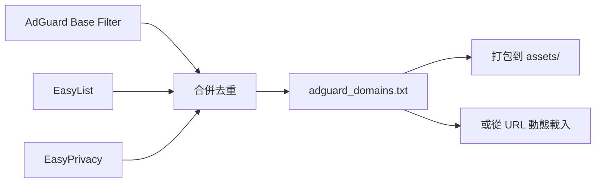
```mermaid
graph LR
    A["AdGuard Base Filter"] --> D["合併去重"]
    B["EasyList"] --> D
    C["EasyPrivacy"] --> D
    D --> E["adguard_domains.txt"]
    E --> F["打包到 assets/"]
    E --> G["或從 URL 動態載入"]
```

### 格式轉換

```
AdGuard 格式:          AdSweep 域名清單:
||doubleclick.net^     doubleclick.net
||googlesyndication.com^ googlesyndication.com
||facebook.com/tr^     facebook.com
@@||example.com^       （白名單，不匯入）
```

轉換規則：
1. 提取 `||` 和 `^` 之間的域名
2. 去除子路徑（只保留域名部分）
3. 忽略白名單規則（`@@`）
4. 忽略非域名規則（CSS selectors、scriptlets 等）
5. 去重排序

### 預估規模

| 清單 | 規則數 | 提取域名數（估計） |
|------|--------|-------------------|
| AdGuard Base | ~60,000 | ~15,000 |
| EasyList | ~90,000 | ~20,000 |
| EasyPrivacy | ~30,000 | ~10,000 |
| 合併去重後 | — | ~30,000 |

30,000 個域名，用 HashSet 存在記憶體中，查詢是 O(1)，對效能幾乎無影響。

## 架構變化

### Callback 層級

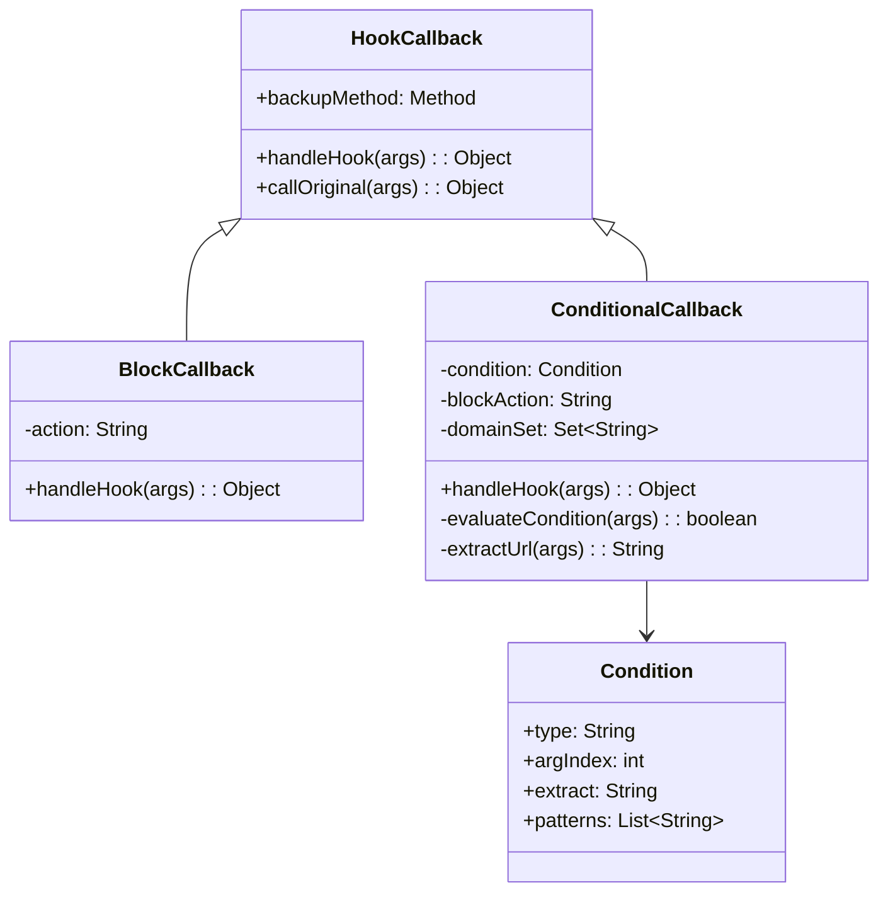
```mermaid
classDiagram
    class HookCallback {
        +backupMethod: Method
        +handleHook(args): Object
        +callOriginal(args): Object
    }

    class BlockCallback {
        -action: String
        +handleHook(args): Object
    }

    class ConditionalCallback {
        -condition: Condition
        -blockAction: String
        -domainSet: Set~String~
        +handleHook(args): Object
        -evaluateCondition(args): boolean
        -extractUrl(args): String
    }

    HookCallback <|-- BlockCallback
    HookCallback <|-- ConditionalCallback

    class Condition {
        +type: String
        +argIndex: int
        +extract: String
        +patterns: List~String~
    }

    ConditionalCallback --> Condition
```

### 現有 vs 新增

```
現有（不變）:
  BlockCallback — 無條件攔截，處理 ALWAYS 類型的規則

新增:
  ConditionalCallback — 條件式攔截，處理有 condition 的規則
  Condition — 條件評估器
  DomainMatcher — 域名比對（HashSet + 子域名匹配）
```

## ConditionalCallback 虛擬碼

```java
public class ConditionalCallback extends HookCallback {
    private Condition condition;
    private String blockAction;
    private Set<String> domainSet;  // 載入的域名清單

    @Override
    public Object handleHook(Object[] args) {
        // 評估條件
        if (evaluateCondition(args)) {
            // 條件符合 → 攔截
            Log.i(TAG, "Blocked: " + description);
            return getReturnValue(blockAction);
        } else {
            // 條件不符合 → 放行
            return callOriginal(args);
        }
    }

    private boolean evaluateCondition(Object[] args) {
        switch (condition.type) {
            case "URL_MATCHES":
                String url = extractUrl(args);
                return url != null && domainSet.contains(extractDomain(url));

            case "ARG_CONTAINS":
                String argStr = extractArg(args);
                return argStr != null && condition.patterns.stream()
                    .anyMatch(argStr::contains);

            case "ARG_REGEX":
                String argVal = extractArg(args);
                return argVal != null && condition.compiledPattern.matcher(argVal).find();

            default:
                return true;  // ALWAYS
        }
    }

    private String extractUrl(Object[] args) {
        Object arg = args[condition.argIndex];
        // OkHttp: Request.url().toString()
        // URL: this.toString()
        // WebView: arg is String directly
        // 用 reflection 嘗試各種方式
        ...
    }
}
```

## 域名比對策略

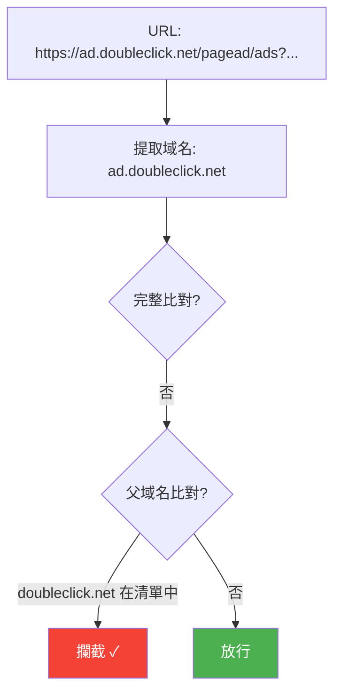
```mermaid
graph TD
    A["URL: https://ad.doubleclick.net/pagead/ads?..."] --> B["提取域名: ad.doubleclick.net"]
    B --> C{"完整比對?"}
    C -->|否| D{"父域名比對?"}
    D -->|"doubleclick.net 在清單中"| E["攔截 ✓"]
    D -->|否| F["放行"]

    style E fill:#f44336,color:#fff
    style F fill:#4CAF50,color:#fff
```

子域名匹配：`ad.doubleclick.net` 要能匹配到清單中的 `doubleclick.net`。
實作方式：逐層去除子域名查詢 HashSet。

```java
boolean matchesDomain(String domain, Set<String> domainSet) {
    // ad.doubleclick.net → doubleclick.net → net
    while (domain.contains(".")) {
        if (domainSet.contains(domain)) return true;
        domain = domain.substring(domain.indexOf('.') + 1);
    }
    return false;
}
```

## 實作優先順序

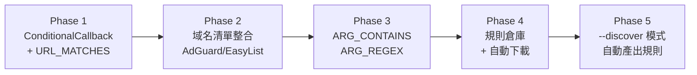
```mermaid
graph LR
    A["Phase 1<br>ConditionalCallback<br>+ URL_MATCHES"] --> B["Phase 2<br>域名清單整合<br>AdGuard/EasyList"]
    B --> C["Phase 3<br>ARG_CONTAINS<br>ARG_REGEX"]
    C --> D["Phase 4<br>規則倉庫<br>+ 自動下載"]
    D --> E["Phase 5<br>--discover 模式<br>自動產出規則"]
```

1. **Phase 1**: 實作 `ConditionalCallback` + `URL_MATCHES` + Hook OkHttp/URL
2. **Phase 2**: 整合 AdGuard/EasyList 域名清單
3. **Phase 3**: 支援 `ARG_CONTAINS` / `ARG_REGEX` 等通用條件
4. **Phase 4**: 規則倉庫 + `--rules-url auto` 自動下載
5. **Phase 5**: `--discover` 模式，自動產出已驗證的規則

## 向後相容

規則格式向後相容——沒有 `condition` 欄位的規則等同 `ALWAYS` 條件：

```json
// 舊格式（繼續運作）
{"className": "AdView", "methodName": "loadAd", "action": "BLOCK_RETURN_VOID"}

// 新格式
{"className": "OkHttpClient", "methodName": "newCall", "action": "BLOCK_RETURN_NULL",
 "condition": {"type": "URL_MATCHES", "source": "adguard_domains.txt"}}
```

`HookManager` 根據有無 `condition` 選擇使用 `BlockCallback` 或 `ConditionalCallback`。

## 已知問題與待改進

### 1. 缺少 MONITOR_ONLY action

`--discover` 模式需要一個只記錄不攔截的 action：

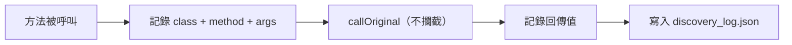
```mermaid
graph LR
    A["方法被呼叫"] --> B["記錄 class + method + args"]
    B --> C["callOriginal（不攔截）"]
    C --> D["記錄回傳值"]
    D --> E["寫入 discovery_log.json"]
```

```json
{
  "id": "discover-okhttp",
  "className": "okhttp3.OkHttpClient",
  "methodName": "newCall",
  "action": "MONITOR_ONLY",
  "enabled": true
}
```

用途：注入後讓用戶正常使用 App，自動記錄所有被呼叫的方法，事後分析哪些是廣告。

### 2. 缺少 CALL_AND_MODIFY action

目前 `BLOCK_RETURN_TRUE` 完全不呼叫原始方法。有些方法有重要的副作用（寫資料庫、更新狀態），需要讓它跑完再修改回傳值：

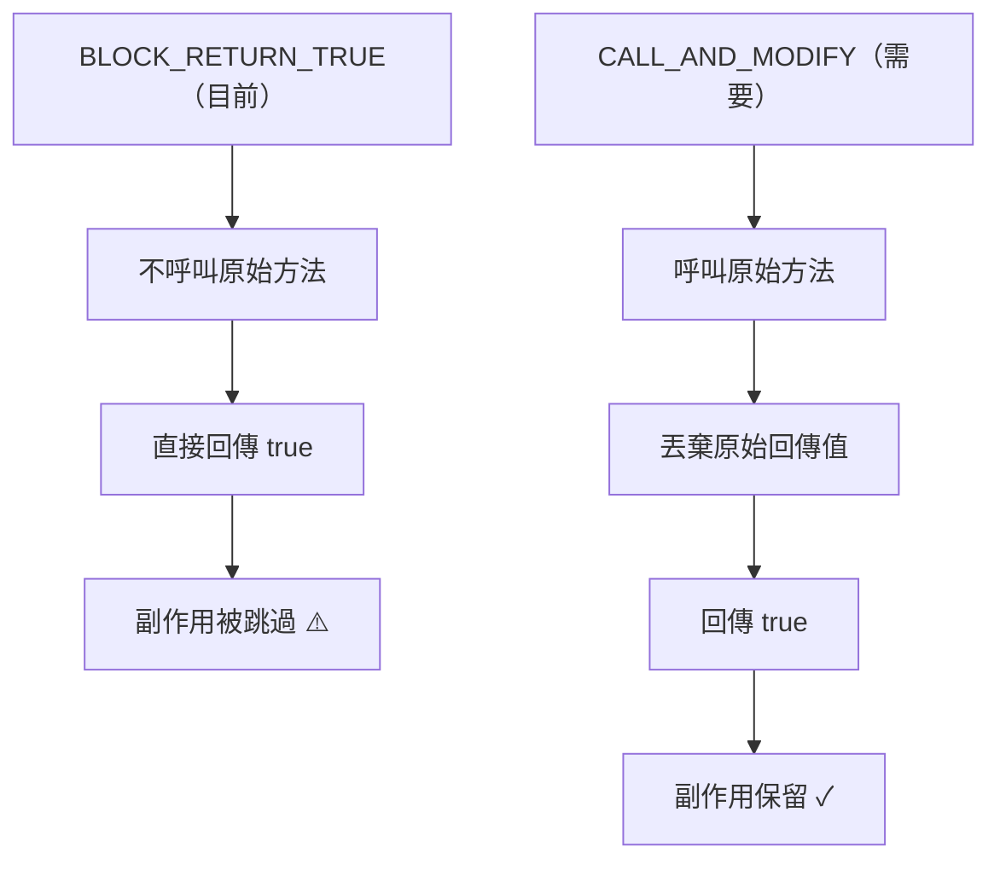
```mermaid
graph TD
    A["BLOCK_RETURN_TRUE（目前）"] --> B["不呼叫原始方法"]
    B --> C["直接回傳 true"]
    C --> D["副作用被跳過 ⚠️"]

    E["CALL_AND_MODIFY（需要）"] --> F["呼叫原始方法"]
    F --> G["丟棄原始回傳值"]
    G --> H["回傳 true"]
    H --> I["副作用保留 ✓"]
```

```json
{
  "id": "mm-premium-safe",
  "className": "com.realbyte.money.config.Globals",
  "methodName": "k",
  "action": "CALL_AND_RETURN_TRUE",
  "notes": "呼叫原始方法保留副作用，但強制回傳 true"
}
```

需要新增的 action：

| Action | 行為 |
|--------|------|
| `CALL_AND_RETURN_TRUE` | 呼叫原始 → 回傳 true |
| `CALL_AND_RETURN_FALSE` | 呼叫原始 → 回傳 false |
| `CALL_AND_RETURN_NULL` | 呼叫原始 → 回傳 null |
| `CALL_AND_LOG` | 同 MONITOR_ONLY |

### 3. 方法重載匹配不精確

混淆後的方法名很短（`a`、`b`、`c`），同一個 class 可能有多個同名方法：

```java
class Globals {
    static boolean a(Context ctx) { ... }  // 方法 1
    static void a(Context ctx, int i) { ... }  // 方法 2
    static String a() { ... }  // 方法 3
}
```

目前省略 `paramTypes` 時匹配第一個，容易 Hook 錯。

**改進方案：**

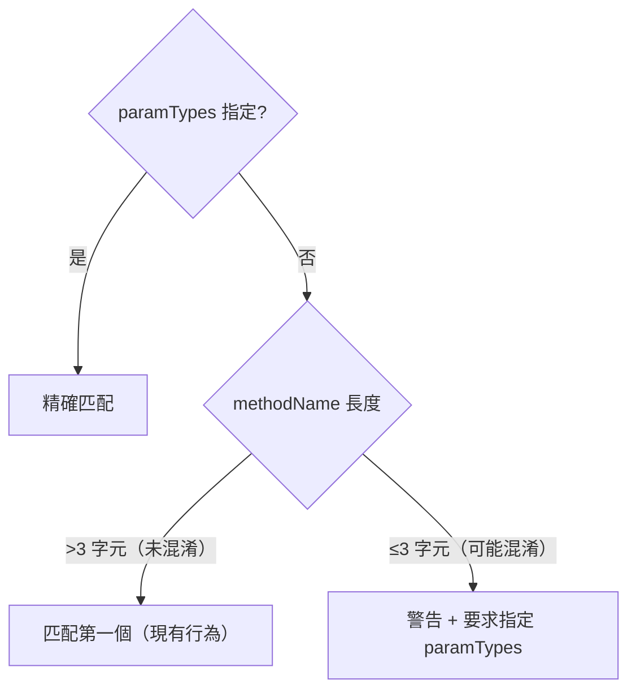
```mermaid
graph TD
    A{paramTypes 指定?} -->|是| B["精確匹配"]
    A -->|否| C{methodName 長度}
    C -->|">3 字元（未混淆）"| D["匹配第一個（現有行為）"]
    C -->|"≤3 字元（可能混淆）"| E["警告 + 要求指定 paramTypes"]
```

或加入 `returnType` 欄位做更精確的匹配：

```json
{
  "className": "com.example.Globals",
  "methodName": "a",
  "paramTypes": ["android.content.Context"],
  "returnType": "boolean",
  "action": "BLOCK_RETURN_TRUE"
}
```

### 4. 規則依賴關係

Money Manager 的簽名檢查繞過（`Main.C2`）是必要前提——沒有它 App 會自己關閉。但目前沒辦法標記這個關係。

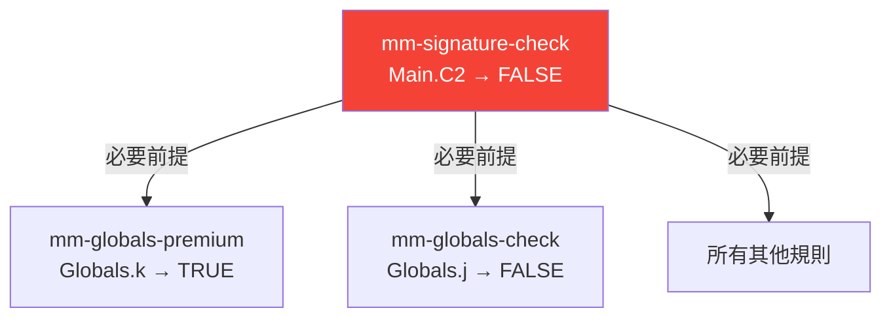
```mermaid
graph TD
    A["mm-signature-check<br>Main.C2 → FALSE"] -->|必要前提| B["mm-globals-premium<br>Globals.k → TRUE"]
    A -->|必要前提| C["mm-globals-check<br>Globals.j → FALSE"]
    A -->|必要前提| D["所有其他規則"]

    style A fill:#f44336,color:#fff
```

**改進方案：**

```json
{
  "id": "mm-globals-premium",
  "depends": ["mm-signature-check"],
  "className": "com.realbyte.money.config.Globals",
  "methodName": "k",
  "action": "BLOCK_RETURN_TRUE"
}
```

`depends` 陣列：如果依賴的規則 Hook 失敗，這條也自動跳過（避免 App 異常）。

### 5. 版本相容性檢查

App 更新後混淆 mapping 變化，`C2` 可能變成 `D3`，規則就失效了。

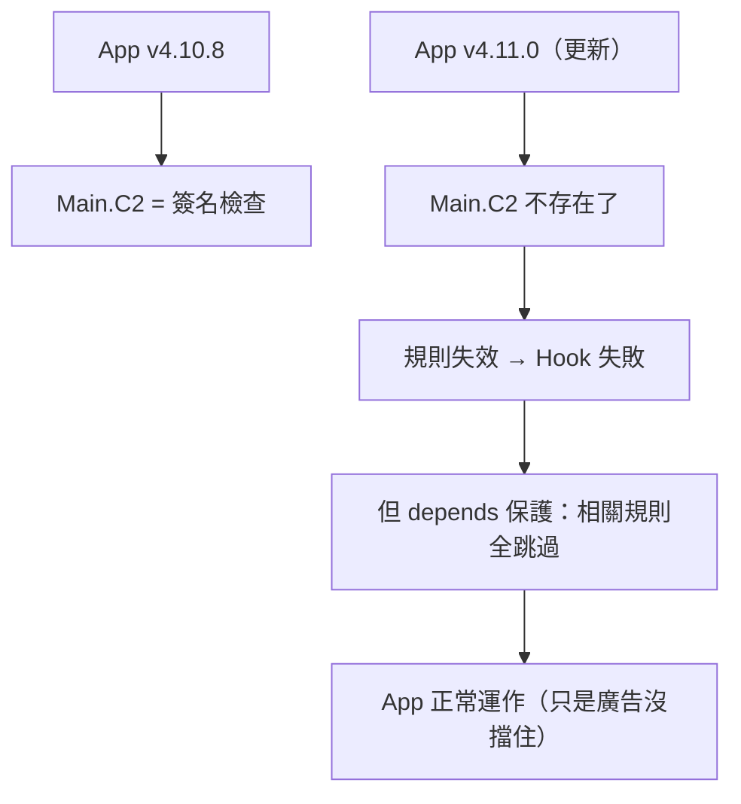
```mermaid
graph TD
    A["App v4.10.8"] --> B["Main.C2 = 簽名檢查"]
    C["App v4.11.0（更新）"] --> D["Main.C2 不存在了"]
    D --> E["規則失效 → Hook 失敗"]
    E --> F["但 depends 保護：相關規則全跳過"]
    F --> G["App 正常運作（只是廣告沒擋住）"]
```

**改進方案：**

```json
{
  "id": "mm-signature-check",
  "className": "com.realbyte.money.ui.main.Main",
  "methodName": "C2",
  "appVersions": {
    "min": "4.10.0",
    "max": "4.10.99",
    "tested": ["4.10.8"]
  }
}
```

inject.py 在注入時讀取 APK 版本號，比對 `appVersions`，版本不匹配時警告用戶。

### 6. Wildcard 規則

有時需要 noop 整個 class 的所有方法（例如 `RbAnalyticAgent` 的所有追蹤方法）：

```json
{
  "id": "mm-analytics-all",
  "className": "com.realbyte.money.utils.log_analytics.RbAnalyticAgent",
  "methodName": "*",
  "action": "BLOCK_RETURN_VOID"
}
```

`*` 表示 Hook 該 class 的**所有 public 方法**。

也可以支援前綴匹配：

```json
{
  "methodName": "load*",
  "notes": "匹配 loadAd, loadBanner, loadInterstitial 等"
}
```

**實作方式：**

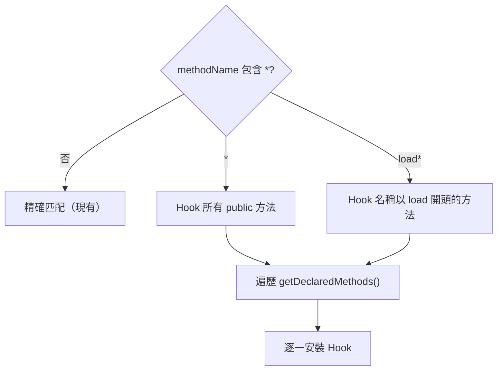
```mermaid
graph TD
    A{methodName 包含 *?} -->|否| B["精確匹配（現有）"]
    A -->|"*"| C["Hook 所有 public 方法"]
    A -->|"load*"| D["Hook 名稱以 load 開頭的方法"]
    C --> E["遍歷 getDeclaredMethods()"]
    D --> E
    E --> F["逐一安裝 Hook"]
```

### 7. 規則分組與標籤

目前用 `sdkName` 做簡單分組，不夠結構化。

```json
{
  "id": "mm-signature-check",
  "tags": ["security", "required", "signature"],
  "category": "bypass",
  "priority": 100
}
```

| 欄位 | 用途 |
|------|------|
| `tags` | 多標籤，方便搜尋過濾 |
| `category` | 分類：`ad`、`tracking`、`bypass`、`privacy`、`network` |
| `priority` | 優先順序，數字越大越先 Hook（確保依賴先安裝） |

## 完整規則格式（未來）

```json
{
  "id": "unique-id",
  "className": "com.example.Class",
  "methodName": "method",
  "paramTypes": ["android.content.Context"],
  "returnType": "boolean",

  "action": "BLOCK_RETURN_TRUE",
  "condition": {
    "type": "URL_MATCHES",
    "argIndex": 1,
    "extract": "url",
    "source": "adguard_domains.txt"
  },
  "elseAction": "PASS_THROUGH",

  "enabled": true,
  "source": "BUILTIN",
  "category": "ad",
  "tags": ["admob", "banner"],
  "priority": 50,
  "depends": ["other-rule-id"],
  "appVersions": {
    "min": "4.10.0",
    "max": "4.10.99",
    "tested": ["4.10.8"]
  },

  "sdkName": "AdMob",
  "notes": "Description"
}
```

## 改進優先順序

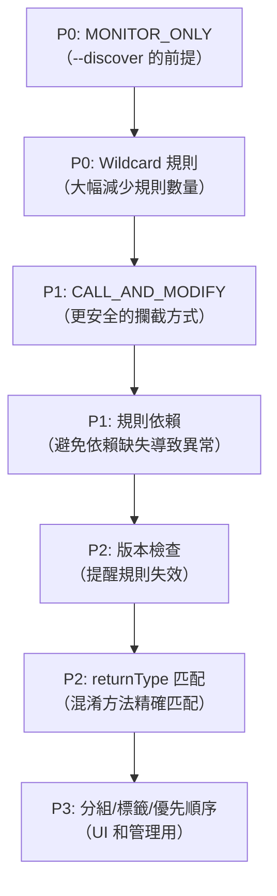
```mermaid
graph TD
    A["P0: MONITOR_ONLY<br>（--discover 的前提）"] --> B["P0: Wildcard 規則<br>（大幅減少規則數量）"]
    B --> C["P1: CALL_AND_MODIFY<br>（更安全的攔截方式）"]
    C --> D["P1: 規則依賴<br>（避免依賴缺失導致異常）"]
    D --> E["P2: 版本檢查<br>（提醒規則失效）"]
    E --> F["P2: returnType 匹配<br>（混淆方法精確匹配）"]
    F --> G["P3: 分組/標籤/優先順序<br>（UI 和管理用）"]
```

| 優先順序 | 項目 | 原因 |
|---------|------|------|
| P0 | MONITOR_ONLY | `--discover` 的基礎 |
| P0 | Wildcard `*` | 一條規則取代十幾條 |
| P1 | CALL_AND_MODIFY | 更安全，減少副作用風險 |
| P1 | 規則依賴 depends | 避免依賴缺失造成 App 異常 |
| P2 | 版本檢查 | 提醒規則失效 |
| P2 | returnType 匹配 | 混淆方法精確匹配 |
| P3 | 分組/標籤/優先順序 | UI 和管理需求 |
| P1 | 多 App 排除 | 通用規則排除特定 App |
| P2 | 動態回傳值 | 回傳空 List/Map/mock 物件 |
| P2 | 延遲 Hook | 動態載入的 class |
| P2 | 規則熱更新 | 不重啟 App 就能改規則 |
| P3 | 規則效果統計 | 顯示每條規則攔截次數 |
| P3 | 規則匯出分享 | 一鍵匯出可提交到規則倉庫的格式 |

### 8. 多 App 規則排除

同一份通用規則裡，某條規則可能對特定 App 造成問題。需要排除機制：

```json
{
  "id": "admob-baseadview-load",
  "className": "com.google.android.gms.ads.BaseAdView",
  "methodName": "loadAd",
  "action": "BLOCK_RETURN_VOID",
  "excludePackages": ["com.some.broken.app", "com.another.app"]
}
```

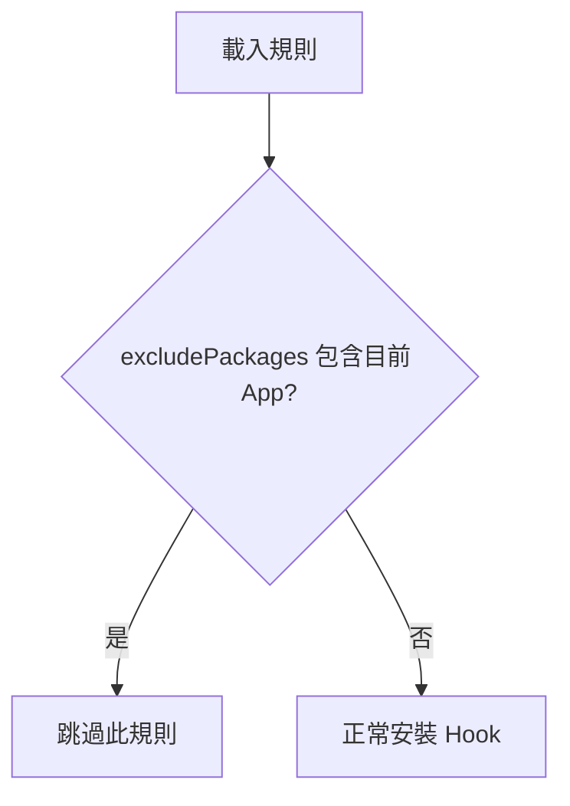
```mermaid
graph TD
    A["載入規則"] --> B{"excludePackages 包含目前 App?"}
    B -->|是| C["跳過此規則"]
    B -->|否| D["正常安裝 Hook"]
```

HookManager 在處理每條規則時，比對當前 App 的 package name 是否在排除清單中。

### 9. 動態回傳值

有些方法需要回傳特定型別的物件，不是簡單的 primitive：

| Action | 回傳值 | 用途 |
|--------|--------|------|
| `BLOCK_RETURN_EMPTY_LIST` | `Collections.emptyList()` | 回傳空列表 |
| `BLOCK_RETURN_EMPTY_MAP` | `Collections.emptyMap()` | 回傳空 Map |
| `BLOCK_RETURN_EMPTY_ARRAY` | `new Object[0]` | 回傳空陣列 |
| `BLOCK_RETURN_MOCK` | 動態產生的空物件 | 回傳 interface 的空實作 |

`BLOCK_RETURN_MOCK` 最複雜——需要用 `java.lang.reflect.Proxy` 動態產生一個空實作：

```java
case "BLOCK_RETURN_MOCK":
    Class<?> returnType = targetMethod.getReturnType();
    if (returnType.isInterface()) {
        return Proxy.newProxyInstance(
            returnType.getClassLoader(),
            new Class[]{returnType},
            (proxy, method, args) -> getDefaultValue(method.getReturnType())
        );
    }
    return null;
```

### 10. 延遲 Hook（Lazy Hook）

某些 class 在 App 啟動時不存在（動態載入、multidex lazy init）。
目前 `ClassNotFoundException` 會直接跳過，但這些 class 後來可能被載入。

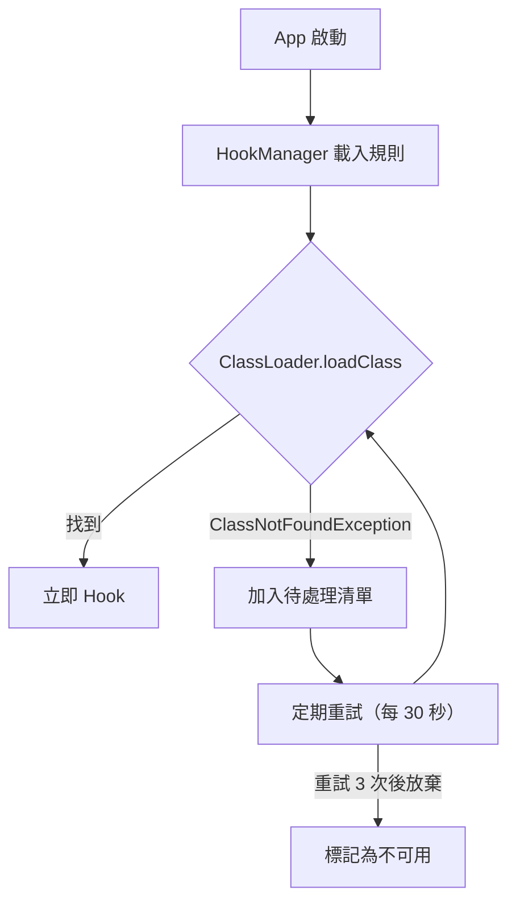
```mermaid
graph TD
    A["App 啟動"] --> B["HookManager 載入規則"]
    B --> C{"ClassLoader.loadClass"}
    C -->|找到| D["立即 Hook"]
    C -->|ClassNotFoundException| E["加入待處理清單"]
    E --> F["定期重試（每 30 秒）"]
    F --> C
    F -->|"重試 3 次後放棄"| G["標記為不可用"]
```

或更精確的做法：Hook `ClassLoader.loadClass` 本身，偵測到目標 class 被載入時自動安裝 Hook。但這又回到了 Hook 高頻方法的問題。

**務實做法：** 提供延遲時間設定。

```json
{
  "id": "lazy-loaded-sdk",
  "className": "com.dynamicload.AdModule",
  "methodName": "show",
  "action": "BLOCK_RETURN_VOID",
  "lazyRetry": {
    "enabled": true,
    "intervalMs": 30000,
    "maxRetries": 3
  }
}
```

### 11. 規則熱更新

目前規則在啟動時載入一次，SettingsActivity 裡修改規則後要重啟 App。

需要支援：
- **新增 Hook**：runtime 安裝新 Hook（LSPlant 支援）
- **移除 Hook**：runtime unhook（LSPlant 支援）
- **修改 Hook**：unhook + 重新 hook

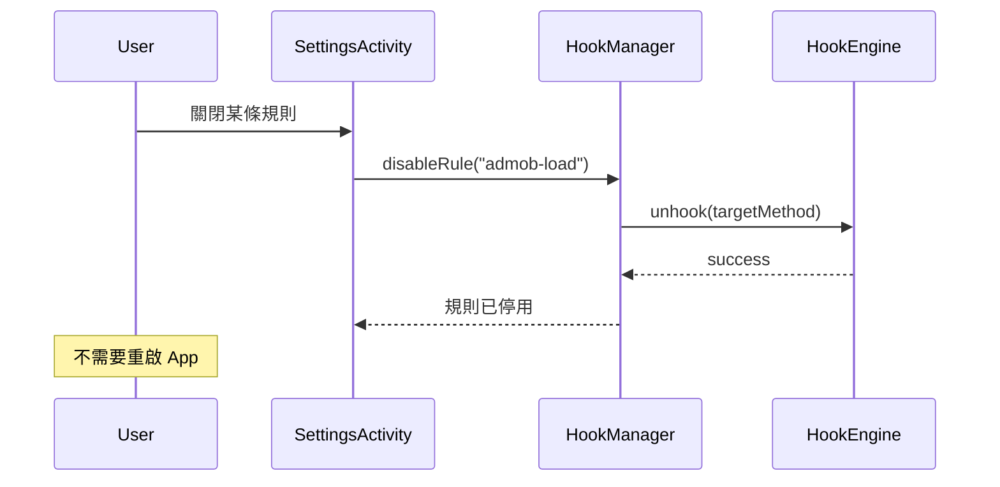
```mermaid
sequenceDiagram
    participant User
    participant SettingsActivity
    participant HookManager
    participant HookEngine

    User->>SettingsActivity: 關閉某條規則
    SettingsActivity->>HookManager: disableRule("admob-load")
    HookManager->>HookEngine: unhook(targetMethod)
    HookEngine-->>HookManager: success
    HookManager-->>SettingsActivity: 規則已停用
    Note over User: 不需要重啟 App
```

HookManager 需要保存 `targetMethod` 的引用，目前只保存了 `backupMethod`。

### 12. 規則效果統計

每條規則記錄攔截次數和最後攔截時間：

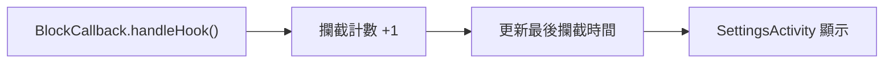
```mermaid
graph LR
    A["BlockCallback.handleHook()"] --> B["攔截計數 +1"]
    B --> C["更新最後攔截時間"]
    C --> D["SettingsActivity 顯示"]
```

```java
public class BlockCallback extends HookCallback {
    private final AtomicInteger blockCount = new AtomicInteger(0);
    private volatile long lastBlockTime = 0;

    @Override
    public Object handleHook(Object[] args) {
        blockCount.incrementAndGet();
        lastBlockTime = System.currentTimeMillis();
        // ...
    }
}
```

SettingsActivity 的規則清單顯示：

```
AdMob BaseAdView.loadAd          [ON]   攔截 47 次
AppLovin AppLovinSdk.initialize  [ON]   攔截 3 次
Custom MyClass.checkLicense      [ON]   攔截 0 次  ← 可能沒用或還沒觸發
```

攔截 0 次的規則可以提示用戶：可能方法名不對、class 不存在、或還沒觸發。

### 13. 規則匯出分享

用戶透過 Layer 3 回報或手動新增的規則，要能匯出為可直接提交到規則倉庫的格式：

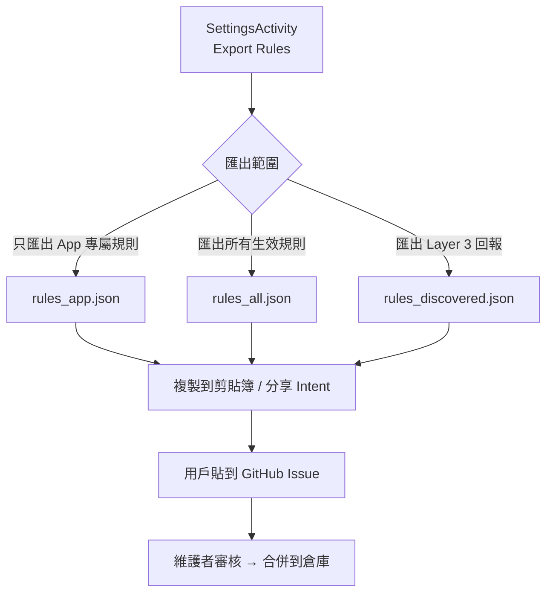
```mermaid
graph TD
    A["SettingsActivity<br>Export Rules"] --> B{"匯出範圍"}
    B -->|"只匯出 App 專屬規則"| C["rules_app.json"]
    B -->|"匯出所有生效規則"| D["rules_all.json"]
    B -->|"匯出 Layer 3 回報"| E["rules_discovered.json"]
    C --> F["複製到剪貼簿 / 分享 Intent"]
    D --> F
    E --> F
    F --> G["用戶貼到 GitHub Issue"]
    G --> H["維護者審核 → 合併到倉庫"]
```

匯出格式應自動附帶 metadata：

```json
{
  "exportedFrom": "AdSweep 1.0.0",
  "exportedAt": "2026-04-06T14:30:00",
  "packageName": "com.realbyteapps.moneymanagerfree",
  "appVersion": "4.10.8",
  "androidApi": 34,
  "rules": [ ... ]
}
```

這樣維護者能知道規則是在什麼環境下產出的。
