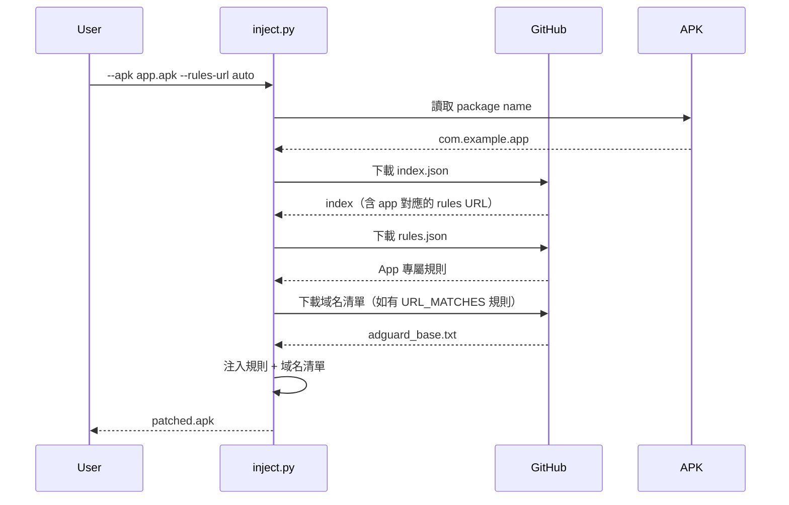
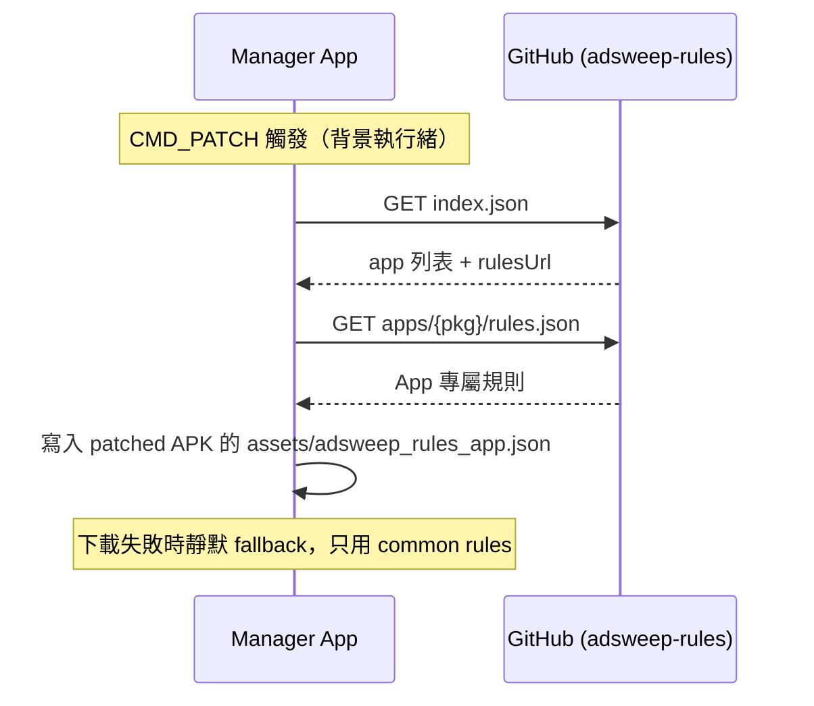
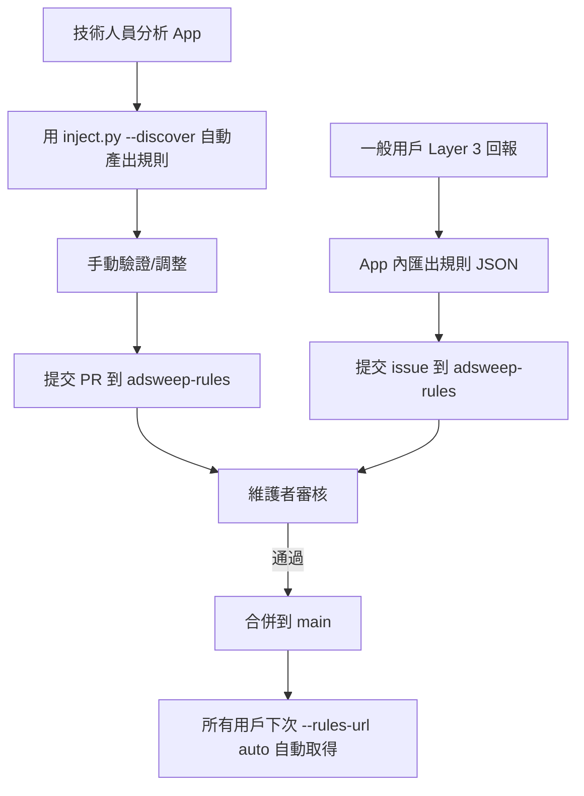
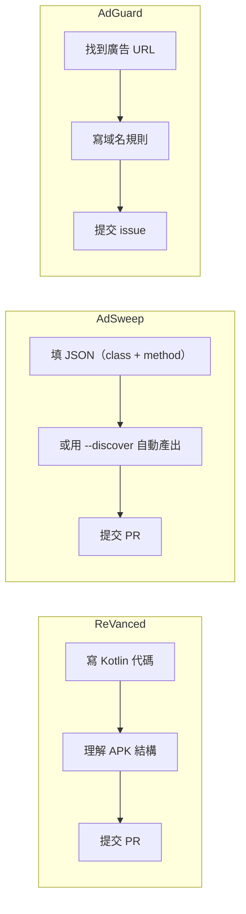
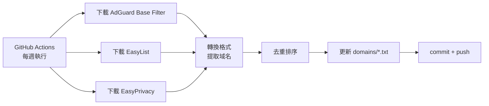

# AdSweep 規則倉庫設計（已實作核心）

## 背景

AdSweep 的規則需要逆向分析才能寫，一般人無法自己產出。
需要一個社群驅動的規則分享機制，讓「一人分析，所有人受益」。

## 參考對象

```mermaid
graph TB
    subgraph "AdGuard Filters"
        AG1["GitHub repo"] --> AG2["按語言/用途分目錄"]
        AG2 --> AG3["文字規則（域名）"]
        AG3 --> AG4["App 自動訂閱更新"]
    end

    subgraph "ReVanced Patches"
        RV1["GitHub repo"] --> RV2["patches.json 元資料"]
        RV2 --> RV3["Kotlin patch 代碼"]
        RV3 --> RV4["Manager App 定期拉取"]
        RV4 --> RV5["用戶勾選 patch"]
    end

    subgraph "AdSweep Rules（設計）"
        AS1["GitHub repo"] --> AS2["按 package name 分檔案"]
        AS2 --> AS3["JSON 規則（比 Kotlin 簡單）"]
        AS3 --> AS4["inject.py 自動下載"]
    end
```



## 倉庫結構

```
adsweep-rules/
├── index.json                              # 所有 App 索引
├── domains/
│   ├── adguard_base.txt                    # AdGuard 域名清單（轉換後）
│   ├── easylist.txt                        # EasyList 域名清單
│   └── easyprivacy.txt                     # EasyPrivacy 域名清單
├── apps/
│   ├── com.realbyteapps.moneymanagerfree/
│   │   ├── rules.json                     # App 專屬規則
│   │   └── metadata.json                  # 名稱、版本、測試狀態
│   ├── com.some.newsapp/
│   │   ├── rules.json
│   │   └── metadata.json
│   └── ...
└── README.md
```

### index.json

```json
{
  "version": 1,
  "updated": "2026-04-06",
  "apps": {
    "com.realbyteapps.moneymanagerfree": {
      "name": "Money Manager",
      "rulesUrl": "apps/com.realbyteapps.moneymanagerfree/rules.json",
      "testedVersion": "4.10.8",
      "status": "verified",
      "hookCount": 9
    }
  },
  "domains": {
    "adguard_base": "domains/adguard_base.txt",
    "easylist": "domains/easylist.txt"
  }
}
```

### metadata.json

```json
{
  "packageName": "com.realbyteapps.moneymanagerfree",
  "appName": "Money Manager",
  "testedVersions": ["4.10.8"],
  "testedAndroid": ["API 34"],
  "status": "verified",
  "author": "tzyyung",
  "lastUpdated": "2026-04-06",
  "notes": "需搭配 split APK 安裝"
}
```

## 使用流程

### 自動下載模式



### 指令（Python Injector）

```bash
# 自動查找並下載規則
python inject.py --apk app.apk --rules-url auto

# 指定規則倉庫（fork 版本）
python inject.py --apk app.apk \
  --rules-url https://raw.githubusercontent.com/someone/adsweep-rules/main

# 只下載規則，不注入（離線使用）
python inject.py --fetch-rules com.example.app --output rules.json
```

### Manager App（On-Device，已實作）

Manager app 在 CMD_PATCH 時自動從 GitHub 下載 app rules：



實作檔案：`manager/src/main/java/com/adsweep/manager/RuleFetcher.java`

## 社群貢獻流程



### 貢獻門檻對比



AdSweep 的 JSON 規則門檻介於 AdGuard（最低）和 ReVanced（最高）之間。
`--discover` 模式可以進一步降低到接近 AdGuard 的水準。

## 規則品質控制

### 狀態標籤

| 狀態 | 說明 |
|------|------|
| `draft` | 剛提交，未驗證 |
| `testing` | 有人在測試 |
| `verified` | 至少一人驗證通過 |
| `stable` | 多人驗證，穩定使用 |
| `broken` | 某版本更新後失效 |

### 版本相容性

App 更新後 class/method name 可能變化（混淆）。
每條規則需記錄 `testedVersions`，App 版本不匹配時提醒用戶。

## 域名清單自動更新



用 GitHub Actions 自動同步上游域名清單，每週更新一次。

## 離線模式

不是所有用戶都方便連網。支援離線使用：

```bash
# 一次性下載所有規則到本地
python inject.py --sync-rules ./local_rules/

# 之後離線使用
python inject.py --apk app.apk --rules-dir ./local_rules/
```

## 實作優先順序

1. **建立 adsweep-rules GitHub repo**，放入 Money Manager 規則作為範例
2. **inject.py 加入 `--rules-url`**，支援從 URL 下載規則
3. **加入 `index.json` 查詢**，支援 `--rules-url auto`
4. **域名清單整合**（需先實作規則引擎）
5. **GitHub Actions 自動更新域名清單**
6. **`--discover` 模式**
